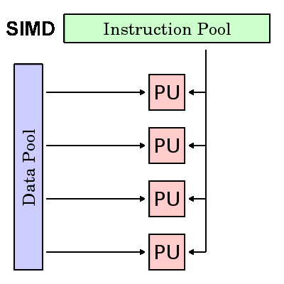

[Skip to main content](https://hpc.llnl.gov/training/tutorials/introduction-parallel-computing-tutorial#main-content)

[](https://www.llnl.gov/)

[](https://hpc.llnl.gov/user-portal)

Search form

Search


- [Portal](https://hpc.llnl.gov/user-portal)
- Accounts
  - [New Account Setup](https://hpc.llnl.gov/accounts/new-account-setup)
  - [IdM Account Management](https://hpc.llnl.gov/accounts/idm-account-management)
  - [Access to LC Systems](https://hpc.llnl.gov/manuals/access-lc-systems)
  - [Computer Coordinator Roles](https://hpc.llnl.gov/accounts/computer-coordinator-roles)
  - [Forms](https://hpc.llnl.gov/accounts/forms)
  - [Policies](https://hpc.llnl.gov/accounts/policies)
  - [Mailing Lists](https://hpc.llnl.gov/accounts/mailing-lists)
- Banks & Jobs
  - [Allocations](https://hpc.llnl.gov/banks-jobs/allocations)
  - Running Jobs
    - [Batch System Primer](https://hpc.llnl.gov/banks-jobs/running-jobs/batch-system-primer)
    - [LSF User Manual](https://hpc.llnl.gov/banks-jobs/running-jobs/lsf-user-manual)
    - [LSF Quick Start Guide](https://hpc.llnl.gov/banks-jobs/running-jobs/lsf-quick-start-guide)
    - [LSF Commands](https://hpc.llnl.gov/banks-jobs/running-jobs/lsf-commands)
    - [Slurm User Manual](https://hpc.llnl.gov/banks-jobs/running-jobs/slurm-user-manual)
    - [Slurm Quick Start Guide](https://hpc.llnl.gov/banks-jobs/running-jobs/slurm-quick-start-guide)
    - [Slurm Commands](https://hpc.llnl.gov/banks-jobs/running-jobs/slurm-commands)
    - [Slurm and Moab](https://hpc.llnl.gov/training/tutorials/slurm-and-moab)
    - [Batch System Cross-Reference](https://hpc.llnl.gov/banks-jobs/running-jobs/batch-system-commands)
    - [Slurm srun versus IBM CSM jsrun](https://hpc.llnl.gov/banks-jobs/running-jobs/slurm-srun-versus-ibm-csm-jsrun)
  - [ASC DAT Request](https://hpc.llnl.gov/accounts/forms/asc-dat)
  - [M&IC DAT Request](https://hpc.llnl.gov/accounts/forms/mic-dat)
- Hardware
  - [Archival Storage Hardware](https://hpc.llnl.gov/hardware/archival-storage-hardware)
  - [Compute Platforms](https://hpc.llnl.gov/hardware/platforms)
  - [Compute Platforms with GPUs](https://hpc.llnl.gov/hardware/compute-platforms-gpus)
  - [File Systems](https://hpc.llnl.gov/hardware/file-systems)
  - [Testbeds](https://hpc.llnl.gov/hardware/testbeds)
  - [Zone Access](https://hpc.llnl.gov/hardware/zone-access)
  - [Zone Content](https://hpc.llnl.gov/hardware/zone-content)
  - [MyLC (Lorenz)](https://lc.llnl.gov/lorenz/mylc/mylc.cgi)
  - [CZ Compute Platform Status](https://lc.llnl.gov/cgi-bin/lccgi/customstatus.cgi?)
  - [RZ Compute System Status](https://rzlc.llnl.gov/cgi-bin/lccgi/customstatus.cgi)
  - [CZ File System Status](https://lc.llnl.gov/fsstatus/fsstatus.cgi)
  - [RZ File System Status](https://rzlc.llnl.gov/fsstatus/fsstatus.cgi)
- Services
  - [Green Data Oasis (GDO)](https://hpc.llnl.gov/services/green-data-oasis)
  - [MyLC (Lorenz)](https://lc.llnl.gov/lorenz/mylc/mylc.cgi)
  - [Visualization Services](https://hpc.llnl.gov/services/visualization-services)
- Software
  - [Archival Storage Software](https://hpc.llnl.gov/software/archival-storage-software)
  - [Data Management Tools](https://hpc.llnl.gov/software/data-management-tools-projects)
  - [Development Environment Software](https://hpc.llnl.gov/software/development-environment-software)
  - [Mathematical Software](https://hpc.llnl.gov/software/mathematical-software)
  - [Modules and Software Packaging](https://hpc.llnl.gov/software/modules-and-software-packaging)
  - [RADIUSS](https://hpc.llnl.gov/radiuss)
  - [Visualization Software](https://hpc.llnl.gov/software/visualization-software)
- Training
  - Tutorials
    - [Introduction to Parallel Computing Tutorial](https://hpc.llnl.gov/training/tutorials/introduction-parallel-computing-tutorial)
    - [LLNL Covid-19 HPC Resource Guide for New Livermore Computing Users](https://hpc.llnl.gov/training/tutorials/llnl-covid-19-hpc-resource-guide)
    - [Using LC's Sierra System](https://hpc.llnl.gov/training/tutorials/using-lcs-sierra-system)
    - [Livermore Computing PSAAP3 Quick Start Tutorial](https://hpc.llnl.gov/training/tutorials/livermore-computing-psaap3-quick-start-tutorial)
    - [PSAAP Alliance Quick Guide](https://hpc.llnl.gov/sites/default/files/PSAAP-alliance-quickguide.docx)
    - [Linux Tutorial Exercise One](https://hpc.llnl.gov/training/tutorials/linux-tutorial-exercises)
    - [Livermore Computing Linux Clusters Overview Part One](https://hpc.llnl.gov/training/tutorials/livermore-computing-linux-commodity-clusters-overview-part-one)
    - [Livermore Computing Linux Clusters Overview Part Two](https://hpc.llnl.gov/training/tutorials/livermore-computing-linux-commodity-clusters-overview-part-two)
    - [Livermore Computing Resources and Environment](https://hpc.llnl.gov/training/tutorials/livermore-computing-resources-and-environment)
    - [Slurm and Moab Exercise](https://hpc.llnl.gov/training/tutorials/slurm-and-moab-exercise)
    - [Slurm and Moab Tutorial](https://hpc.llnl.gov/training/tutorials/slurm-and-moab)
    - [TotalView Part 2: Common Functions](https://hpc.llnl.gov/training/tutorials/totalview-part-2-common-functions)
    - [TotalView Part 3: Debugging Parallel Programs](https://hpc.llnl.gov/training/tutorials/totalview-part-3-debugging-parallel-programs)
    - [TotalView Tutorial](https://hpc.llnl.gov/training/tutorials/totalview-tutorial)
    - [Tutorial Evaluation Form](https://hpc.llnl.gov/training/tutorials/evaluation-form)
    - [srun --auto-affinity](https://hpc.llnl.gov/training/tutorials/srun-auto-affinity)
    - [srun --multi-prog](https://hpc.llnl.gov/training/tutorials/srun-multi-prog)
  - [Documentation & User Manuals](https://hpc.llnl.gov/training/documentation)
  - [Technical Bulletins Catalog](https://hpc.llnl.gov/training/technical-bulletins-catalog)
  - [Training Events](https://hpc.llnl.gov/training/workshop-schedule)
  - [User Meeting Presentation Archive](https://hpc.llnl.gov/training/user-meeting-presentations-archive)

[General Site](https://hpc.llnl.gov/)[User Portal](https://hpc.llnl.gov/user-portal)

## breadcrumb menu

[主页](https://hpc.llnl.gov/)»[培训](https://hpc.llnl.gov/training)»[教程](https://hpc.llnl.gov/training/tutorials)»并行计算教程简介

[易于列印](https://hpc.llnl.gov/print/588)

# 并行计算教程简介

## 目录

1. 抽象的
   1. 并行计算概述
      1. [什么是并行计算？](https://hpc.llnl.gov/training/tutorials/introduction-parallel-computing-tutorial#Whatis)
      2. [为什么要使用并行计算？](https://hpc.llnl.gov/training/tutorials/introduction-parallel-computing-tutorial#WhyUse)
      3.  [谁在使用并行计算？](https://hpc.llnl.gov/training/tutorials/introduction-parallel-computing-tutorial#Who)
   2. 概念和术语
      1. [冯·诺依曼计算机体系结构](https://hpc.llnl.gov/training/tutorials/introduction-parallel-computing-tutorial#Neumann)
      2. [弗林的古典分类学](https://hpc.llnl.gov/training/tutorials/introduction-parallel-computing-tutorial#Flynn)
      3. [一些通用并行术语](https://hpc.llnl.gov/training/tutorials/introduction-parallel-computing-tutorial#Terminology)
      4. [并行编程的局限性和成本](https://hpc.llnl.gov/training/tutorials/introduction-parallel-computing-tutorial#LimitsCosts)
   3. 并行计算机内存架构
      1. [共享内存](https://hpc.llnl.gov/training/tutorials/introduction-parallel-computing-tutorial#SharedMemory)
      2. [分布式内存](https://hpc.llnl.gov/training/tutorials/introduction-parallel-computing-tutorial#DistributedMemory)
      3. [混合分布式共享内存](https://hpc.llnl.gov/training/tutorials/introduction-parallel-computing-tutorial#HybridMemory)
   4. 并行编程模型
      1. [并行编程模型概述](https://hpc.llnl.gov/training/tutorials/introduction-parallel-computing-tutorial#ModelsOverview)
      2. [共享内存模型](https://hpc.llnl.gov/training/tutorials/introduction-parallel-computing-tutorial#ModelsShared)
      3. [线程模型](https://hpc.llnl.gov/training/tutorials/introduction-parallel-computing-tutorial#ModelsThreads)
      4. [分布式内存/消息传递模型](https://hpc.llnl.gov/training/tutorials/introduction-parallel-computing-tutorial#ModelsMessage)
      5. [数据并行模型](https://hpc.llnl.gov/training/tutorials/introduction-parallel-computing-tutorial#ModelsData)
      6. [混合模型](https://hpc.llnl.gov/training/tutorials/introduction-parallel-computing-tutorial#Hybrid)
      7. [SPMD和MPMP](https://hpc.llnl.gov/training/tutorials/introduction-parallel-computing-tutorial#SPMD-MPMD)
   5. 设计并行程序
      1. [自动和手动并行化](https://hpc.llnl.gov/training/tutorials/introduction-parallel-computing-tutorial#DesignAutomatic)
      2. [了解问题和程序](https://hpc.llnl.gov/training/tutorials/introduction-parallel-computing-tutorial#DesignUnderstand)
      3. [分区](https://hpc.llnl.gov/training/tutorials/introduction-parallel-computing-tutorial#DesignPartitioning)
      4. [通讯技术](https://hpc.llnl.gov/training/tutorials/introduction-parallel-computing-tutorial#DesignCommunications)
      5. [同步化](https://hpc.llnl.gov/training/tutorials/introduction-parallel-computing-tutorial#DesignSynchronization)
      6. [数据依存关系](https://hpc.llnl.gov/training/tutorials/introduction-parallel-computing-tutorial#DesignDependencies)
      7. [负载均衡](https://hpc.llnl.gov/training/tutorials/introduction-parallel-computing-tutorial#DesignLoadBalancing)
      8. [粒度](https://hpc.llnl.gov/training/tutorials/introduction-parallel-computing-tutorial#DesignGranularity)
      9. [输入/输出](https://hpc.llnl.gov/training/tutorials/introduction-parallel-computing-tutorial#DesignIO)
      10. [调试](https://hpc.llnl.gov/training/tutorials/introduction-parallel-computing-tutorial#DesignDebug)
      11. [性能分析和调优](https://hpc.llnl.gov/training/tutorials/introduction-parallel-computing-tutorial#DesignPerformance)
   6. 平行范例
      1. [阵列处理](https://hpc.llnl.gov/training/tutorials/introduction-parallel-computing-tutorial#ExamplesArray)
      2.  [PI计算](https://hpc.llnl.gov/training/tutorials/introduction-parallel-computing-tutorial#ExamplesPI)
      3. [简单热方程](https://hpc.llnl.gov/training/tutorials/introduction-parallel-computing-tutorial#ExamplesHeat)
      4. [一维波动方程](https://hpc.llnl.gov/training/tutorials/introduction-parallel-computing-tutorial#ExamplesWave)
   7. [参考和更多信息](https://hpc.llnl.gov/training/tutorials/introduction-parallel-computing-tutorial#References)

## 抽象的

这是“ Livermore Computing Getting Started”讲习班中的第一篇教程。本文仅打算简要介绍并行计算的广泛而广泛的主题，作为其后续教程的简介。这样，它仅涵盖并行计算的基础知识，并且适合刚熟悉该主题并计划参加本研讨会中的一个或多个其他教程的人员。它不打算深入介绍并行编程，因为这将需要更多的时间。本教程首先讨论并行计算-它是什么以及如何使用它，然后讨论与并行计算相关的概念和术语。然后探讨并行存储器体系结构和编程模型的主题。这些主题之后，就与设计和运行并行程序有关的许多复杂问题进行了一系列实际讨论。本教程以如何并行化简单串行程序的几个示例结束。包括参考资料以供进一步的自学。

## 概述

### 什么是并行计算？

#### 串行计算

 传统上，已经编写了用于***串行\***计算的软件：

- 一个问题被分解成一系列离散的指令
- 指令依次执行
- 在单个处理器上执行
- 任何时候都只能执行一条指令


## [serialProblem.gif](https://hpc.llnl.gov/files/serialproblemgif)


 **例如：**


## [serialProblem2.gif](https://hpc.llnl.gov/files/serialproblem2gif)


#### 并行计算

从最简单的意义上讲，***并行计算\***是同时使用多个计算资源来解决一个计算问题：

- 一个问题被分解成可以同时解决的离散部分
- 每个部分都进一步细分为一系列说明
- 每个部分的指令在不同的处理器上同时执行
- 采用了总体控制/协调机制


## [parallelProblem.gif](https://hpc.llnl.gov/files/parallelproblemgif)


**例如：**


## [parallelProblem2.gif](https://hpc.llnl.gov/files/parallelproblem2gif)


- 计算问题应该能够：
  - 分解成可以同时解决的分散工作；
  - 随时执行多个程序指令；
  - 与使用单个计算资源相比，使用多个计算资源可以在更短的时间内解决问题。
- 计算资源通常为：
  - 一台具有多个处理器/核心的计算机
  - 通过网络连接的任意数量的此类计算机

#### 并行计算机

- 从硬件角度来看，当今几乎所有独立计算机都是并行的：
  - 多个功能单元（L1缓存，L2缓存，分支，预取，解码，浮点，图形处理（GPU），整数等）
  - 多个执行单元/核心
  - 多个硬件线程


## [bgqComputeChip.jpeg](https://hpc.llnl.gov/files/bgqcomputechipjpeg)


###### 具有18个内核（PU）和16个L2高速缓存单元（L2）的IBM BG / Q计算芯片

 

- 网络连接多台独立计算机（节点）以组成更大的并行计算机群集。

 

## [nodesNetwork.gif](https://hpc.llnl.gov/files/nodesnetworkgif)


- 例如，以下示意图显示了典型的LLNL并行计算机集群：
  - 每个计算节点本身就是一台多处理器并行计算机
  - 多个计算节点与一个Infiniband网络联网
  - 特殊目的节点（也可以是多处理器）用于其他目的


## [parallelComputer1.gif](https://hpc.llnl.gov/files/parallelcomputer1gif)


- 世界上大多数大型并行计算机（超级计算机）都是由（大多数）知名供应商生产的硬件集群。


## [top500Vendors.jpeg](https://hpc.llnl.gov/files/top500vendorsjpeg)


*资料来源：[Top500.org](https://www.top500.org/)*

### 为什么要使用并行计算？

#### 现实世界是平行的

- 在自然界中，许多复杂的，相互关联的事件在同一时间发生，但发生在时间序列上。
- 与串行计算相比，并行计算更适合于建模，模拟和理解复杂的现实世界现象。
- 例如，假设按顺序对这些模型进行建模：


## [realWorldCollage1.jpeg](https://hpc.llnl.gov/files/realworldcollage1jpeg)


## [realWorldCollage2.jpeg](https://hpc.llnl.gov/files/realworldcollage2jpeg)


 

#### 主要原因

##### 节省时间和/或金钱

- 从理论上讲，将更多资源投入一项任务将缩短其完成时间，并可能节省成本。
- 并行计算机可以由廉价的商品组件构建而成。


## [timeMoney2.jpeg](https://hpc.llnl.gov/files/timemoney2jpeg)


##### 解决更大/更复杂的问题

- 许多问题是如此之大和/或复杂，以至于使用串行程序解决这些问题是不切实际或不可能的，特别是在计算机内存有限的情况下。
- 示例：“大挑战问题”（[en.wikipedia.org/wiki/Grand_Challenge](https://en.wikipedia.org/wiki/Grand_Challenges)）需要千万亿次浮点运算和PB级的计算资源。
- 示例：Web搜索引擎/数据库每秒处理数百万个事务


## [GreaterProblems.jpeg](https://hpc.llnl.gov/files/biggerproblemsjpeg)


##### 提供保密性

- 单个计算资源一次只能做一件事。多个计算资源可以同时做很多事情。
- 示例：协作网络提供了一个全球场所，来自世界各地的人们可以“虚拟地”见面并开展工作。


## [operativeNetworks.jpeg](https://hpc.llnl.gov/files/collaborativenetworksjpeg)


##### 利用非本地资源

- 当本地计算资源稀缺或不足时，请在广域网甚至Internet上使用计算资源。
- 示例：[SETI @ home](mailto:SETI@home)（[setiathome.berkeley.edu](http://setiathome.berkeley.edu/)）在全球几乎每个国家/地区拥有170万用户。（2018年5月）。
- 示例：[Folding @ home](mailto:Folding@home)（[folding.stanford.edu](http://folding.stanford.edu/)）全球超过180万贡献者（2018年5月）


## [SETILogo.jpeg](https://hpc.llnl.gov/files/setilogojpeg)


##### 更好地使用基础并行硬件

- 现代计算机，甚至是笔记本电脑，在架构上都是并行的，具有多个处理器/内核。
- 并行软件专门用于具有多个内核，线程等的并行硬件。
- 在大多数情况下，在现代计算机上运行的串行程序会“浪费”潜在的计算能力。


## [xeon5600processorDie3.jpeg](https://hpc.llnl.gov/files/xeon5600processordie3jpeg)


#### 未来

- 在过去的20多年中，越来越快的网络，分布式系统和多处理器计算机体系结构（甚至在台式机级别）所表明的趋势清楚地表明，***并行性是计算的未来\***。
- 在同一时间段内，超级计算机的性能提高了**500,000**倍以上，目前还看不到尽头。
- *Exascale Computing竞赛已经开始！*
  - Exaflop =每秒10 18次计算


## [top500.1993-2016.gif](https://hpc.llnl.gov/files/top5001993-2016gif)


*资料来源：[Top500.org](https://www.top500.org/)*

### 谁在使用并行计算？

#### 科学与工程

- 从历史上看，并行计算一直被认为是“计算的高端”，并已被用来模拟许多科学和工程领域中的难题：
- 大气，地球，环境
- 物理-应用的，核的，粒子的，凝结的物质，高压，聚变，光子学
- 生物科学，生物技术，遗传学
- 化学，分子科学
- 地质，地震
- 机械工程-从假肢到航天器
- 电机工程，电路设计，微电子学
- 计算机科学，数学
- 国防，武器


## [Simulations01.jpeg](https://hpc.llnl.gov/files/simulations01jpeg)


#### 工商业

- 如今，商业应用在更快的计算机开发中提供了同等或更大的驱动力。这些应用程序需要以复杂的方式处理大量数据。例如：
- “大数据”，数据库，数据挖掘
- 人工智能（AI）
- 石油勘探
- 网络搜索引擎，基于网络的商业服务
- 医学影像与诊断
- 药物设计
- 财务和经济建模
- 国家和跨国公司的管理
- 先进的图形和虚拟现实，尤其是在娱乐行业
- 网络视频和多媒体技术
- 协同工作环境


## [Simulations03.jpg](https://hpc.llnl.gov/files/simulations03-jpg)


#### 全球应用

- 现在，并行计算已在世界范围内广泛应用于各种应用程序中。


## [top500Apps.gif](https://hpc.llnl.gov/files/top500appsgif)


*资料来源：[Top500.org](https://www.top500.org/)*


## [top500SegmentsTime.jpeg](https://hpc.llnl.gov/files/top500segmentstimejpeg)


## [top500CountriesTime.jpeg](https://hpc.llnl.gov/files/top500countriestimejpeg)


*资料来源：[Top500.org](https://www.top500.org/)*

## 概念和术语

### 冯·诺依曼建筑

## [vonNeumann2.jpeg](https://hpc.llnl.gov/files/vonneumann2jpeg)


###### *约翰·冯·诺依曼 （John von Neumann）约1940年代（来源：LANL档案）*

- 以匈牙利数学家约翰·冯·诺伊曼（John von Neumann）的名字命名，他在1945年的论文中首次提出了对电子计算机的一般要求。
- 也称为“存储程序计算机”-程序指令和数据都保存在电子存储器中。与通过“硬接线”编程的早期计算机不同。
- 从那时起，几乎所有计算机都遵循此基本设计：

## [vonNeumann1.gif](https://hpc.llnl.gov/files/vonneumann1gif)


- 由四个主要部分组成：

<ol style =“ list-style-type：lower-alpha;”>
<li>内存</ li>
<li>控制单元<​​/ li>
<li>算术逻辑单元</ li>
<li>输入/输出</ li>
</ ol>

- 读/写，随机存取存储器用于存储程序指令和数据

<ol style =“ list-style-type：lower-alpha;”>

<li>程序指令是编码数据，可告诉计算机执行某项操作</ li>
<li>数据仅是程序要使用的信息</ li>
</ ol>

- 控制单元从存储器中获取指令/数据，对指令进行解码，然后***顺序地\***协调操作以完成编程任务。
- 算术单元执行基本算术运算
- 输入/输出是操作员的界面

 

 

 

- 有关他其他杰出成就的更多信息，请访问：[http](http://en.wikipedia.org/wiki/John_von_Neumann)：[//en.wikipedia.org/wiki/John_von_Neumann](http://en.wikipedia.org/wiki/John_von_Neumann)
- 所以呢？谁在乎？
  - 好吧，并行计算机仍然遵循此基本设计，只是成倍增加。基本的基本架构保持不变。

### 弗林的古典分类学

- 有多种方法可以对并行计算机进行分类。参考中提供了示例[。](https://hpc.llnl.gov/sites/default/files/parallelClassifications_0.pdf)
- 自1966年以来一直使用的一种更广泛使用的分类称为Flynn's Taxonomy。
- Flynn的分类法根据如何按照***指令流\***和***数据流***的两个独立维度对多处理器计算机体系结构进行分类来区分它们。这些维度中的每一个只能具有以下两种可能状态之一：***Single***或***Multiple***。
- 下面的矩阵根据Flynn定义了4种可能的分类：


## [flynnsTaxonomy.gif](https://hpc.llnl.gov/files/flynnstaxonomygif)


#### 单指令单数据（SISD）

- 串行（非并行）计算机
- **单条指令：**在任何一个时钟周期内，CPU仅作用一条指令流
- **单个数据：**在任何一个时钟周期内，只有一个数据流被用作输入
- 确定性执行
- 这是最古老的计算机类型
- 例如：较早的大型机，小型计算机，工作站和单处理器/核心PC。

| [sisd2.gif](https://hpc.llnl.gov/files/sisd2gif) |                                                              | [sisd.gif](https://hpc.llnl.gov/files/sisdgif) |
| ------------------------------------------------------------ | ------------------------------------------------------------ | ------------------------------------------------------------ |
| [univac1.LLNL_.200pix.jpeg](https://hpc.llnl.gov/files/univac1llnl200pixjpeg) | [ibm.360.200pix.jpeg](https://hpc.llnl.gov/files/ibm360200pixjpeg) | [cray1.LLNL_.200pix.jpeg](https://hpc.llnl.gov/files/cray1llnl200pixjpeg) |
| [cdc7600.LLNL_.200pix.jpeg](https://hpc.llnl.gov/files/cdc7600llnl200pixjpeg) | [pdp1.LLNL_.200pix.jpeg](https://hpc.llnl.gov/files/pdp1llnl200pixjpeg-0) | [dellLaptop.200pix.jpeg](https://hpc.llnl.gov/files/delllaptop200pixjpeg) |

#### 单指令多数据（SIMD）

- 一种并行计算机
- **一条指令：**所有处理单元在任何给定的时钟周期执行同一条指令
- **多个数据：**每个处理单元可以对不同的数据元素进行操作
- 最适合以高度规律性为特征的特殊问题，例如图形/图像处理。
- 同步（锁步）和确定性执行
- 两种：处理器阵列和矢量流水线
- 例子：
  - 处理器阵列：思维机CM-2，MasPar MP-1和MP-2，ILLIAC IV
  - 向量管道：IBM 9000，Cray X-MP，Y-MP和C90，富士通VP，NEC SX-2，日立S820，ETA10
- 大多数现代计算机，特别是具有图形处理器单元（GPU）的计算机，都采用SIMD指令和执行单元。

| [simd3.gif](https://hpc.llnl.gov/files/simd3gif) |                                                              |                                                              | [simd.gif](https://hpc.llnl.gov/files/simdgif) |
| ------------------------------------------------------------ | ------------------------------------------------------------ | ------------------------------------------------------------ | ------------------------------------------------------------ |
| [illiacIV.200pix.jpeg](https://hpc.llnl.gov/files/illiaciv200pixjpeg) | [MasPar.200pix.jpeg](https://hpc.llnl.gov/files/maspar200pixjpeg) |                                                              | [simd2.gif](https://hpc.llnl.gov/files/simd2gif) |
| [crayXMP.200pix.jpeg](https://hpc.llnl.gov/files/crayxmp200pixjpeg) | [crayYMP.200pix.jpeg](https://hpc.llnl.gov/files/crayymp200pixjpeg) | [cm2.200pix.jpeg](https://hpc.llnl.gov/files/cm2200pixjpeg) | [cellProcessor.200pix.jpeg](https://hpc.llnl.gov/files/cellprocessor200pixjpeg) |

#### 多指令单数据（MISD）

- 一种并行计算机
- **多指令：**每个处理单元通过单独的指令流独立地对数据进行操作。
- **单个数据：**单个数据流被馈送到多个处理单元中。
- 几乎没有此类并行计算机的实际示例。
- 一些可能的用途可能是：
  - 在单个信号流上运行的多个频率滤波器
  - 试图破解一条编码消息的多种密码算法。

| [misd4.gif](https://hpc.llnl.gov/files/misd4gif) | [misd.gif](https://hpc.llnl.gov/files/misdgif) |
| ------------------------------------------------------------ | ------------------------------------------------------------ |
|                                                              |                                                              |

多指令，多数据（MIMD）

- 一种并行计算机
- **多指令：**每个处理器可能正在执行不同的指令流
- **多个数据：**每个处理器可能正在使用不同的数据流
- 执行可以是同步或异步，确定性或非确定性
- 当前，最常见的并行计算机类型-大多数现代超级计算机都属于此类。
- 示例：最新的超级计算机，联网的并行计算机集群和“网格”，多处理器SMP计算机，多核PC。
- ***\*注意，\**** 许多MIMD体系结构还包括SIMD执行子组件。

| [mimd2.gif](https://hpc.llnl.gov/files/mimd2gif) |                                                              | [mimd.gif](https://hpc.llnl.gov/files/mimdgif) |
| ------------------------------------------------------------ | ------------------------------------------------------------ | ------------------------------------------------------------ |
| [ibmPower5Cluster.200pix.jpeg](https://hpc.llnl.gov/files/ibmpower5cluster200pixjpeg) | [alphaserverCluster.200pix.jpeg](https://hpc.llnl.gov/files/alphaservercluster200pixjpeg) | [ia32Cluster.200pix.jpeg](https://hpc.llnl.gov/files/ia32cluster200pixjpeg) |
| [opteronCluster.200pix.jpeg](https://hpc.llnl.gov/files/opteroncluster200pixjpeg) | [crayXT3Cluster.200pix.jpeg](https://hpc.llnl.gov/files/crayxt3cluster200pixjpeg) | [bglCluster.200pix.jpeg](https://hpc.llnl.gov/files/bglcluster200pixjpeg) |

### 一些通用并行术语

- 像其他所有内容一样，并行计算也有自己的“行话”。下面列出了一些与并行计算相关的更常用术语。
- 这些中的大多数将在后面更详细地讨论。

##### 超级计算/高性能计算（HPC）

使用世界上最快，最大的计算机来解决大问题。

##### 节点

一台独立的“盒子中的计算机”。通常由多个CPU /处理器/内核，内存，网络接口等组成。节点通过网络连接在一起组成一台超级计算机。

##### CPU /插槽/处理器/核心

这取决于您与谁交谈。过去，CPU（中央处理单元）是计算机的单一执行组件。然后，将多个CPU合并到一个节点中。然后，将各个CPU细分为多个“核”，每个核都是一个唯一的执行单元。具有多个内核的CPU有时称为“插槽”-取决于供应商。结果是一个节点具有多个CPU，每个CPU包含多个内核。术语有时会混淆。想知道为什么？


## [nodeSocketCores.jpeg](https://hpc.llnl.gov/files/nodesocketcoresjpeg)


##### 任务

计算工作的逻辑上不连续的部分。任务通常是由处理器执行的程序或类程序指令集。并行程序由在多个处理器上运行的多个任务组成。

##### 流水线

将任务分解为由不同处理器单元执行的步骤，输入流通过，就像流水线一样；一种并行计算。

##### 共享内存

从严格的硬件角度出发，描述了一种计算机体系结构，其中所有处理器都可以直接（通常是基于总线）访问公共物理内存。从编程的角度讲，它描述了一个模型，其中并行任务都具有相同的“图片”内存，并且可以直接寻址和访问相同的逻辑内存位置，而不管物理内存实际存在于何处。

##### 对称多处理器（SMP）

共享内存硬件体系结构，其中多个处理器共享一个地址空间，并且可以平等地访问所有资源。

##### 分布式内存

在硬件中，是指不常见的基于网络的物理内存访问。作为编程模型，任务只能在逻辑上“查看”本地计算机内存，并且必须使用通信来访问执行其他任务的其他计算机上的内存。

##### 通讯技术

并行任务通常需要交换数据。有几种方法可以完成此操作，例如通过共享内存总线或通过网络，但是无论采用哪种方法，实际的数据交换事件通常称为通信。

##### 同步化

实时并行任务的协调，通常与通信相关联。通常是通过在应用程序中建立一个同步点来实现的，在该同步点上，一个任务可能不会继续进行，直到另一个任务（一个或多个）到达相同或逻辑上等效的点为止。

同步通常涉及等待至少一个任务，因此可能导致并行应用程序的挂钟执行时间增加。

##### 粒度

在并行计算中，粒度是计算与通信之比的定性度量。

- ***粗略：***通信事件之间完成了相对大量的计算工作
- ***很好：\***在通信事件之间完成了相对少量的计算工作

##### 观察到的加速

观察到已并行化的代码的加速，定义为：

```
        串行执行的挂钟时间
        -----------------------------------
        并行执行的挂钟时间
```

并行程序性能的最简单，使用最广泛的指标之一。

##### 并行开销

协调并行任务所需的时间，而不是进行有用的工作。并行开销可能包括以下因素：

- 任务启动时间
- 同步化
- 数据通讯
- 并行语言，库，操作系统等施加的软件开销。
- 任务终止时间

##### 大规模平行

指包含给定并行系统的硬件-具有许多处理元素。“许多”的含义在不断增加，但是目前，最大的并行计算机由数以十万到数百万的处理元件组成。

##### 尴尬地平行

同时解决许多相似但独立的任务；几乎没有必要在任务之间进行协调。

##### 可扩展性

指并行系统的能力（硬件和/或软件），通过增加更多的资源来演示并行速度的按比例提高。促成可伸缩性的因素包括：

- 硬件-特别是内存cpu带宽和网络通信属性
- 应用算法
- 并行开销
- 您的特定应用程序的特征

### 并行编程的局限性和成本

#### 阿姆达尔定律

## [amdahl1.gif](https://hpc.llnl.gov/files/amdahl1gif-0)


## [amdahl2.gif](https://hpc.llnl.gov/files/amdahl2gif-0)


 

- 阿姆达尔定律指出，潜在的程序加速由可并行化的部分代码（P）定义：

```
                         1个
        加速= --------
                       1-P
```

- 如果没有代码可以并行化，则P = 0且speedup = 1（无加速）。
- 如果将所有代码并行化，则P = 1并且加速是无限的（理论上）。
- 如果可以并行处理50％的代码，则最大加速= 2，这意味着代码将以两倍的速度运行。
- 通过介绍执行并行工作的处理器数量，可以通过以下方式对这种关系进行建模：

```
                           1个 
        加速= ------------
                        P + S
                       ---
                        ñ
```

- 其中P =并行分数，N =处理器数量，S =串行分数。

 


 

- 很快变得很明显，并行性的可伸缩性受到了限制。例如：

```
                           加速
              -------------------------------------
        NP = .50 P = .90 P = .95 P = .99
      ----- ------- ------- ------- -------
         10 1.82 5.26 6.89 9.17
        100 1.98 9.17 16.80 50.25    
      1,000 1.99 9.91 19.62 90.99
     10,000 1.99 9.91 19.96 99.02
    100,000 1.99 9.99 19.99 99.90
```

- **“著名”报价：** *您可以花费一生的时间来获取95％的代码进行并行处理，无论您投入多少处理器，都永远无法获得超过20倍的加速！*

- 但是，某些问题通过增加问题的大小证明了性能的提高。例如：

```
        2D网格计算    
        平行分数85秒85％   
        连续分数15秒15％   
```

- 我们可以通过将网格尺寸加倍并将时间步长减半来增加问题的大小。这将导致网格点数量增加四倍，时间步长增加两倍。时间如下：

 

```
        2D网格计算 
        平行分数680秒97.84％   
        连续分数15秒2.16％   
```

- 与并行时间百分比固定的问题相比，增加并行时间百分比的问题具有更大的***可扩展性\***。

#### 复杂

- 通常，并行应用程序比相应的串行应用程序复杂得多，可能一个数量级。您不仅要同时执行多个指令流，而且还需要在它们之间流动数据。
- 在软件开发周期的几乎每个方面，复杂性的成本都以程序员的时间来衡量：
  - 设计
  - 编码
  - 调试
  - 调音
  - 维护
- 在使用并行应用程序时，必须遵循“良好”的软件开发规范，尤其是在您之外的其他人必须使用该软件的情况下。

#### 可移植性

- 由于几个API（例如MPI，POSIX线程和OpenMP）已实现标准化，因此并行程序的可移植性问题不再像过去几年那样严重。然而...
- 与串行程序相关的所有常见可移植性问题都适用于并行程序。例如，如果您对Fortran，C或C ++使用供应商的“增强功能”，则可移植性将成为问题。
- 即使存在几种API的标准，实现的细节也会有所不同，有时甚至需要修改代码以实现可移植性。
- 操作系统可以在代码可移植性问题中发挥关键作用。
- 硬件体系结构的特征是高度可变的，并且会影响可移植性。

#### 资源需求

- 并行编程的主要目的是减少执行挂钟时间，但是要实现这一点，需要更多的CPU时间。例如，在8个处理器上运行1小时的并行代码实际上会占用8小时的CPU时间。
- 由于需要复制数据以及与并行支持库和子系统相关的开销，并行代码所需的内存量可能大于串行代码所需的内存量。
- 对于短期运行的并行程序，与类似的串行实现相比，实际上可能会降低性能。与设置并行环境，任务创建，通信和任务终止相关的间接费用可能占短期总执行时间的很大一部分。

#### 可扩展性

## [strongWeakScaling.gif](https://hpc.llnl.gov/files/strongweakscalinggif)


- 基于求解时间的两种缩放类型：强缩放和弱缩放。
- 强大的扩展能力：
  - 随着添加更多处理器，总的问题大小将保持不变。
  - 目标是更快地运行相同的问题大小
  - 完美的缩放比例意味着问题可以在1 / P时间内解决（与串行相比）
- 弱缩放：
  - 随着添加更多处理器，*每个处理器*的问题大小保持固定。问题总数与使用的处理器数量成正比。
  - 目标是在相同的时间内运行更大的问题
  - 完美的扩展意味着问题Px与单处理器运行同时运行
- 并行程序性能的扩展能力是许多相互关联的因素的结果。仅仅添加更多的处理器很少能解决这个问题。
- 该算法可能具有可伸缩性的固有限制。在某些时候，添加更多的资源会导致性能下降。这是许多并行应用程序的常见情况。
- 硬件因素在可伸缩性中起着重要作用。例子：
  - SMP机器上的Memory-cpu总线带宽
  - 通讯网络带宽
  - 任何给定机器或一组机器上可用的内存量
  - 处理器时钟速度

- 并行支持库和子系统软件可能会限制与您的应用程序无关的可伸缩性。

 

## 并行计算机内存架构

### 共享内存

 

#### 一般特征

- 共享内存并行计算机相差很大，但通常具有所有处理器将所有内存作为全局地址空间访问的能力。
- 多个处理器可以独立运行，但是共享相同的内存资源。
- 一个处理器影响的内存位置更改对所有其他处理器可见。
- 从历史上看，基于内存访问时间，共享内存机器已分为***UMA***和***NUMA***。

#### 统一内存访问（UMA）

- 今天最常见的是***对称多处理器（SMP）***机器

- 相同的处理器

- 平等的访问和对内存的访问时间

- 有时称为CC-UMA-缓存一致性UMA。缓存一致性意味着如果一个处理器更新共享内存中的位置，则所有其他处理器都知道该更新。高速缓存一致性在硬件级别实现。

  ## [shared_mem.gif](https://hpc.llnl.gov/files/sharedmemgif)

  

#### 非统一内存访问（NUMA）

- 通常通过物理链接两个或多个SMP来完成
- 一个SMP可以直接访问另一个SMP的内存
- 并非所有处理器对所有内存的访问时间均相等
- 跨链接的内存访问速度较慢
- 如果维护了缓存一致性，则也可以称为CC-NUMA-缓存一致性NUMA


## [numa.gif](https://hpc.llnl.gov/files/numagif)


#### 好处

- 全局地址空间为存储器提供了用户友好的编程视角
- 由于内存接近CPU，因此任务之间的数据共享既快速又统一

#### 缺点

- 主要缺点是内存和CPU之间缺乏可伸缩性。添加更多的CPU可以在几何上增加共享内存-CPU路径上的流量，对于高速缓存一致性系统，可以在几何上增加与高速缓存/内存管理相关的流量。
- 程序员负责同步的结构可确保对全局内存的“正确”访问。

### 分布式内存

#### 一般特征

- 像共享内存系统一样，分布式内存系统变化很大，但是具有一个共同的特征。分布式内存系统需要一个通信网络来连接处理器间内存。

- 处理器具有自己的本地内存。一个处理器中的内存地址不会映射到另一处理器，因此没有跨所有处理器的全局地址空间的概念。

- 因为每个处理器都有自己的本地内存，所以它独立运行。它对其本地内存所做的更改不会影响其他处理器的内存。因此，缓存一致性的概念不适用。

- 当一个处理器需要访问另一个处理器中的数据时，通常是程序员的任务是明确定义如何以及何时传递数据。任务之间的同步同样是程序员的责任。

- 尽管可以像以太网一样简单，但用于数据传输的网络“结构”却千差万别。

  

  ## [distribution_mem.gif](https://hpc.llnl.gov/files/distributedmemgif)

  

#### 好处

- 内存可随处理器数量扩展。增加处理器数量，并且内存大小按比例增加。
- 每个处理器都可以快速访问自己的内存，而不会产生干扰，也不会尝试维持全局缓存一致性而产生开销。
- 成本效益：可以使用商品的，现成的处理器和网络。

#### 缺点

- 程序员负责与处理器之间的数据通信相关的许多细节。
- 可能很难将基于全局内存的现有数据结构映射到此内存组织。
- 内存访问时间不一致-与节点本地数据相比，驻留在远程节点上的数据需要更长的访问时间。

### 混合分布式共享内存

#### 一般特征

- 当今世界上最大和最快的计算机采用共享和分布式内存体系结构。

| [hybrid_mem.gif](https://hpc.llnl.gov/files/hybridmemgif) | [hybrid_mem2.gif](https://hpc.llnl.gov/files/hybridmem2gif) |
| ------------------------------------------------------------ | ------------------------------------------------------------ |
|                                                              |                                                              |

 

- 共享内存组件可以是共享内存机器和/或图形处理单元（GPU）。
- 分布式内存组件是多个共享内存/ GPU机器的网络，这些机器仅知道自己的内存，而不知道另一台机器上的内存。因此，需要网络通信才能将数据从一台机器移动到另一台机器。
- 当前的趋势似乎表明，在可预见的未来，这种类型的内存体系结构将继续占主导地位，并在高端计算领域不断增加。

#### 的优点和缺点

- 共享和分布式内存体系结构的共同点。
- 增加可伸缩性是一个重要的优势
- 程序员复杂性的增加是一个重要的缺点

## 并行编程模型

### 概述

- 有几种常用的并行编程模型：
  - 共享内存（无线程）
  - 线程数
  - 分布式内存/消息传递
  - 数据并行
  - 杂交种
  - 单程序多数据（SPMD）
  - 多程序多数据（MPMD）
- **并行编程模型作为硬件和内存体系结构之上的抽象而存在。**
- 尽管看起来似乎并不明显，但这些模型**并非**特定于特定类型的计算机或内存体系结构。实际上，这些模型中的任何一个都可以（理论上）在任何基础硬件上实现。下面讨论两个过去的例子。

##### 分布式内存计算机上的共享内存模型

肯德尔广场研究（KSR）ALLCACHE方法。机器内存在物理上分布在联网的机器上，但对用户而言却显示为单个共享内存的全局地址空间。通常，此方法称为“虚拟共享内存”。

| [modelAbstraction1.gif](https://hpc.llnl.gov/files/modelabstraction1gif) | [ksr1.gif](https://hpc.llnl.gov/files/ksr1gif) |
| ------------------------------------------------------------ | ------------------------------------------------------------ |
|                                                              |                                                              |

 

##### 共享存储计算机上的分布式内存模型

SGI Origin 2000上的消息传递接口（MPI）。SGIOrigin 2000采用CC-NUMA类型的共享内存体系结构，其中每个任务都可以直接访问分布在所有计算机上的全局地址空间。但是，已经实现并普遍使用了通过MPI发送和接收消息的功能，就像在分布式存储机器的网络上通常所做的那样。

| [modelAbstraction2.gif](https://hpc.llnl.gov/files/modelabstraction2gif) | [sgiOrigin2000.jpeg](https://hpc.llnl.gov/files/sgiorigin2000jpeg) |
| ------------------------------------------------------------ | ------------------------------------------------------------ |
|                                                              |                                                              |

 

- **使用哪种型号？**这通常是可用资源和个人选择的结合。没有“最佳”模型，尽管某些模型肯定比其他模型有更好的实现。
- 以下各节描述了上述每个模型，并讨论了它们的一些实际实现。

### 共享内存模型（无线程）

## [sharedMemoryModel.gif](https://hpc.llnl.gov/files/sharedmemorymodelgif)


- 在此编程模型中，进程/任务共享一个公共地址空间，它们可以异步地对其进行读写。

- 各种机制（例如锁/信号量）用于控制对共享内存的访问，解决争用并防止争用条件和死锁。

- 这也许是最简单的并行编程模型。

- 从程序员的角度来看，此模型的优点是缺少数据“所有权”的概念，因此无需明确指定任务之间的数据通信。所有进程都可以看到共享存储并享有同等的访问权限。程序开发通常可以简化。

- 在性能方面的一个重要缺点是，它变得更加难以理解和管理

  *数据局部性*

  ：

  - 将数据保留在其上正在处理的进程本地，可以节省内存访问，高速缓存刷新以及在多个进程使用同一数据时发生的总线流量。
  - 不幸的是，控制数据局部性很难理解，并且可能超出了普通用户的控制范围。

**实现方式：**

- 在独立的共享内存计算机上，本机操作系统，编译器和/或硬件为共享内存编程提供支持。例如，POSIX标准提供了一个使用共享内存的API，而UNIX提供了共享内存段（shmget，shmat，shmctl等）。
- 在分布式内存计算机上，内存在物理上分布在计算机网络中，但是通过专用的硬件和软件使其成为全局内存。可以使用多种SHMEM实现：[http](https://en.wikipedia.org/wiki/SHMEM) : [//en.wikipedia.org/wiki/SHMEM](https://en.wikipedia.org/wiki/SHMEM)。

### 线程模型

## [threadsModel2.gif](https://hpc.llnl.gov/files/threadsmodel2gif)


- 此编程模型是共享存储器编程的一种。
- 在并行编程的线程模型中，单个“重负载”进程可以具有多个“轻负载”并发执行路径。
- 例如：
  - 主程序**a.out**计划由本机操作系统运行。**a.out**加载并获取运行所需的所有必要系统和用户资源。这是“沉重的”过程。
  - **a.out**执行一些串行工作，然后创建许多任务（线程），这些任务（线程）可以由操作系统同时调度和运行。
  - 每个线程都有本地数据，但也共享**a.out**的全部资源。这节省了与为每个线程复制程序资源相关的开销（“轻量级”）。每个线程还受益于全局内存视图，因为它共享**a.out**的内存空间。
  - 最好将线程的工作描述为主程序中的子例程。任何线程都可以与其他线程同时执行任何子例程。
  - 线程通过全局内存（更新地址位置）相互通信。这需要同步结构，以确保多个线程不会在任何时候更新同一全局地址。
  - 线程可以来来去去，但是**a.out**仍然存在，以提供必要的共享资源，直到应用程序完成为止。

**实现方式：**

- 从编程的角度来看，线程实现通常包括：
  - 从并行源代码中调用的子例程库
  - 嵌入在串行或并行源代码中的一组编译器指令

在这两种情况下，程序员都负责确定并行性（尽管编译器有时可以提供帮助）。

- 线程实现在计算中并不是新事物。从历史上看，硬件供应商已经实现了自己专有的线程版本。这些实现方式彼此大不相同，这使程序员难以开发可移植的线程应用程序。
- 无关的标准化工作导致了两种非常不同的线程实现：***POSIX线程\***和***OpenMP。\***

##### POSIX线程

- 由IEEE POSIX 1003.1c标准（1995）指定。仅C语言。
- Unix / Linux操作系统的一部分
- 基于图书馆
- 通常称为Pthreads。
- 非常明确的并行性；需要程序员对细节的高度关注。

##### OPENMP的

-  行业标准，由一组主要的计算机硬件和软件供应商，组织和个人共同定义和认可。
- 基于编译器指令
- 便携式/多平台，包括Unix和Windows平台
- 在C / C ++和Fortran实现中可用
- 可以非常容易和简单地使用-提供“增量并行性”。可以以序列号开头。
- 其他线程实现是常见的，但此处未讨论：
  - 微软线程
  - Java，Python线程
  - GPU的CUDA线程

#### 更多信息

- POSIX线程教程：[computing.llnl.gov/tutorials/pthreads](https://computing.llnl.gov/tutorials/pthreads/)
- OpenMP教程：[computing.llnl.gov/tutorials/openMP](https://computing.llnl.gov/tutorials/openMP/)

### 分布式内存/消息传递模型

## [msg_pass_model.gif](https://hpc.llnl.gov/files/msgpassmodelgif)


- 该模型展示了以下特征：
  - 一组在计算过程中使用自己的本地内存的任务。多个任务可以驻留在同一台物理计算机上和/或跨任意数量的计算机。
  - 任务通过发送和接收消息通过通信交换数据。
  - 数据传输通常需要每个流程执行协同操作。例如，发送操作必须具有匹配的接收操作。

**实现方式：**

- 从编程的角度来看，消息传递实现通常包括子例程库。对这些子例程的调用嵌入在源代码中。程序员负责确定所有并行性。
- 从历史上看，自1980年代以来，已有各种消息传递库。这些实现方式彼此大不相同，这使程序员难以开发可移植的应用程序。
- MPI论坛于1992年成立，其主要目标是为消息传递实现建立标准接口。
- **消息传递接口（MPI）的**第1部分于1994年发布。第2部分（MPI-2）于1996年发布，MPI-3于2012年发布。所有MPI规范均可从以下网站获取：[http：//www.mpi- forum.org/docs/](http://www.mpi-forum.org/docs/)。
- MPI是消息传递的“事实上”行业标准，实际上替代了用于生产工作的所有其他消息传递实现。MPI实现几乎适用于所有流行的并行计算平台。并非所有实现都包含MPI-1，MPI-2或MPI-3中的所有内容。

#### 更多信息

- MPI教程：[computing.llnl.gov/tutorials/mpi](https://computing.llnl.gov/tutorials/mpi/)

### 数据并行模型

## [data_parallel_model.gif](https://hpc.llnl.gov/files/dataparallelmodelgif)


- 也可以称为**分区全局地址空间（PGAS）**模型。
- 数据并行模型展示了以下特征：
  - 地址空间被全局处理
  - 大多数并行工作都集中在对数据集执行操作上。数据集通常组织成一个公共结构，例如数组或多维数据集。
  - 一组任务共同在同一数据结构上工作，但是，每个任务在同一数据结构的不同分区上工作。
  - 任务在其工作分区上执行相同的操作，例如，“向每个数组元素加4”。
- 在共享内存体系结构上，所有任务都可以通过全局内存访问数据结构。
- 在分布式内存体系结构上，全局数据结构可以在任务之间逻辑和/或物理上拆分。

**实现方式：**

- 当前，有几种基于Data Parallel / PGAS模型的相对流行的，有时是开发性的并行编程实现。
- **Coarray Fortran：**用于SPMD并行编程的Fortran 95的一小部分扩展。取决于编译器。更多信息：[https](https://en.wikipedia.org/wiki/Coarray_Fortran) : [//en.wikipedia.org/wiki/Coarray_Fortran](https://en.wikipedia.org/wiki/Coarray_Fortran)
- **统一并行C（UPC）：**对SPMD并行编程的C编程语言的扩展。取决于编译器。详细信息：[https](https://upc.lbl.gov/) : [//upc.lbl.gov/](https://upc.lbl.gov/)
- **全局数组：**在分布式数组数据结构的上下文中提供共享的内存样式编程环境。具有C和Fortran77绑定的公共域库。详细信息：[https](https://en.wikipedia.org/wiki/Global_Arrays) : [//en.wikipedia.org/wiki/Global_Arrays](https://en.wikipedia.org/wiki/Global_Arrays)
- **X10：** IBM在Thomas J. Watson研究中心开发的基于**PGAS**的并行编程语言。详细信息：[http](http://x10-lang.org/) : [//x10-lang.org/](http://x10-lang.org/)
- **Chapel：**由Cray领导的开源并行编程语言项目。详细信息：[http](http://chapel.cray.com/) : [//chapel.cray.com/](http://chapel.cray.com/)

### 混合模型

## [hybrid_model.gif](https://hpc.llnl.gov/files/hybridmodelgif)


## [hybrid_model2.gif](https://hpc.llnl.gov/files/hybridmodel2gif)


- 混合模型结合了多个以上描述的编程模型。
- 当前，混合模型的常见示例是消息传递模型（MPI）与线程模型（OpenMP）的组合。
  - 线程使用本地节点数据执行计算密集型内核
  - 使用MPI通过网络在不同节点上的进程之间进行通信
- 这种混合模型非常适合集群多核/多核计算机的最流行（当前）硬件环境。
- 混合模型的另一个类似且越来越流行的示例是将MPI与CPU-GPU（图形处理单元）编程一起使用。
  - MPI任务使用本地内存在CPU上运行，并通过网络相互通信。
  - 计算密集型内核将卸载到节点上的GPU。
  - 节点本地内存和GPU之间的数据交换使用CUDA（或类似方法）。
- 其他混合模型很常见：
  - 带Pthread的MPI
  - 具有非GPU加速器的MPI
  - ...

 

 

### SPMD和MPMD

#### 单程序多数据（SPMD）

## [spmd_model.gif](https://hpc.llnl.gov/files/spmdmodelgif)


- SPMD实际上是一个“高级”编程模型，可以基于前面提到的并行编程模型的任何组合来构建。
- 单个程序：所有任务同时执行同一程序的副本。该程序可以是线程，消息传递，并行数据或混合数据。
- 多个数据：所有任务可能使用不同的数据
- SPMD程序通常在其中编程有必要的逻辑，以允许不同的任务分支或有条件地仅执行被设计为执行的程序部分。也就是说，任务不一定必须执行整个程序-可能只是其中一部分。
- 使用消息传递或混合编程的SPMD模型可能是多节点群集最常用的并行编程模型。

 

#### 多程序多数据（MPMD）

## [mpmd_model.gif](https://hpc.llnl.gov/files/mpmdmodelgif)


- 像SPMD一样，MPMD实际上是一个“高级”编程模型，可以基于前面提到的并行编程模型的任何组合来构建。
- 多个程序：任务可以同时执行不同的程序。程序可以是线程，消息传递，并行数据或混合数据。
- 多个数据：所有任务可能使用不同的数据
- MPMD应用程序不像SPMD应用程序那样常见，但可能更适合于某些类型的问题，尤其是那些比域分解更适合于功能分解的问题（稍后将在“分区”中进行讨论）。

## 设计并行程序

### 自动和手动并行化

- 设计和开发并行程序通常是一个非常手工的过程。程序员通常负责识别并实际实现并行性。
- 通常，手动开发并行代码是一个耗时，复杂，容易出错和迭代的过程。
- 多年来，已有各种工具可用来帮助程序员将串行程序转换为并行程序。用于自动并行化串行程序的最常见工具是并行化编译器或预处理器。
- 并行化编译器通常以两种不同的方式工作：

##### 全自动的

- 编译器分析源代码并确定并行的机会。
- 分析包括确定并行性的障碍，并可能对并行性是否会真正提高性能进行成本加权。
- 循环（执行）是自动并行化的最常见目标。

##### 程序员指导

- 使用“编译器指令”或可能的编译器标志，程序员可以明确地告诉编译器如何并行化代码。
- 也可以与某种程度的自动并行化结合使用。

- 最常见的编译器生成的并行化是使用节点上的共享内存和线程（例如OpenMP）完成的。
- 如果您以现有的序列号开始并且有时间或预算限制，那么自动并行化可能是答案。但是，有一些重要的警告适用于自动并行化：
  - 可能产生错误的结果
  - 性能实际上可能会下降
  - 比手动并行化要灵活得多
  - 限于代码的子集（主要是循环）
  - 如果编译器分析表明存在抑制因素或代码过于复杂，则可能实际上无法并行化代码

- 本节的其余部分适用于开发并行代码的手动方法。

### 了解问题和程序

## [hotspotBottleneck2.jpeg](https://hpc.llnl.gov/files/hotspotbottleneck2jpeg)


- 无疑，开发并行软件的第一步是首先了解您希望并行解决的问题。如果您从串行程序开始，则还需要了解现有代码。
- 在花时间尝试开发问题的并行解决方案之前，请确定问题是否是可以实际并行化的问题。
  - 易于理解的问题的示例：

**计算一个分子的数千个独立构象的势能。完成后，找到最小的能量构象。**

这个问题可以并行解决。每个分子构象是可独立确定的。最小能量构象的计算也是一个可并行化的问题。

- 几乎没有并行性的问题示例：

**使用以下公式计算斐波那契数列（0,1,1,2,3,5,8,13,21，...）：**
**F（n）= F（n-1）+ F（n- 2）**

F（n）值的计算使用F（n-1）和F（n-2）的值，它们必须首先计算。

- 确定程序的

  *热点*

  ：

  - 了解大多数实际工作在哪里完成。大多数科学技术计划通常在少数地方完成大部分工作。
  - 探查器和性能分析工具可以为您提供帮助
  - 专注于并行化热点，而忽略程序中占用CPU很少的部分。

- 确定程序中的

  **瓶颈**

  ：

  - 是否存在速度过慢或导致可并行工作停止或推迟的区域？例如，I / O通常会使程序变慢。
  - 可能可以重组程序或使用其他算法来减少或消除不必要的慢速区域

- 确定并行性的抑制剂。一类常见的抑制剂是*数据依赖性*，如上面的斐波那契序列所证明的。

- 如果可能，研究其他算法。在设计并行应用程序时，这可能是最重要的考虑因素。

- 充分利用领先供应商提供的优化的第三方并行软件和高度优化的数学库（IBM的ESSL，英特尔的MKL，AMD的AMCL等）。

### 分区

- 设计并行程序的第一步之一就是将问题分解为离散的“块”，这些块可以分配给多个任务。这称为分解或分区。
- 在并行任务之间划分计算工作有两种基本方法：***域分解\***和***功能分解\***。

#### 域分解

- 在这种类型的分区中，与问题相关的数据被分解。然后，每个并行任务都会处理部分数据。


## [domain_decomp.gif](https://hpc.llnl.gov/files/domaindecompgif)


- 有多种分区数据的方法：


## [distributions.gif](https://hpc.llnl.gov/files/distributionsgif)


#### 功能分解

- 在这种方法中，重点是要执行的计算，而不是计算所操纵的数据。根据必须完成的工作分解了问题。然后，每个任务执行全部工作的一部分。


## [functional_decomp.gif](https://hpc.llnl.gov/files/functionaldecompgif)


- 功能分解非常适合于可以分解为不同任务的问题。例如：

##### 生态系统建模

每个程序都会计算给定组的人口，其中每个组的增长取决于其邻居的增长。随着时间的流逝，每个进程都会计算其当前状态，然后与邻居进行信息交换。然后，所有任务将继续进行，以在下一个时间步骤中计算状态。


## [functional_ex1.gif](https://hpc.llnl.gov/files/functionalex1gif)


##### 信号处理

音频信号数据集通过四个不同的计算滤波器。每个过滤器都是一个单独的过程。第一段数据必须先通过第一个过滤器，然后才能进行第二个过滤器。当它这样做时，数据的第二段将通过第一过滤器。到第四段数据在第一个过滤器中时，所有四个任务都已繁忙。


## [functional_ex2.gif](https://hpc.llnl.gov/files/functionalex2gif)


##### 气候模拟

每个模型组件都可以视为一个单独的任务。箭头表示计算过程中组件之间的数据交换：大气模型生成海洋模型使用的风速数据，海洋模型生成大气模型使用的海面温度数据，依此类推。

## [functional_ex3.gif](https://hpc.llnl.gov/files/functionalex3gif)


## [ClimateModelling.jpg](https://hpc.llnl.gov/files/climatemodelling-png)

[](https://hpc.llnl.gov/sites/default/files/climateModelling.jpg)

- 将这两种类型的问题分解结合在一起是很自然的。

### 通讯技术

#### 谁需要沟通？

- 任务之间的通信需求取决于您的问题：

##### 你不需要沟通

- 某些类型的问题可以分解和并行执行，而实际上不需要共享数据的任务。这些类型的问题通常***令人尴尬地\***称为***并行\***-几乎不需要通信。
- 例如，想象一个图像处理操作，其中黑白图像中的每个像素都需要使其颜色反转。图像数据可以轻松地分配到多个任务，然后彼此独立行动以完成其工作。


## [black2white.gif](https://hpc.llnl.gov/files/black2whitegif)


##### 您确实需要沟通

- 大多数并行应用程序不是那么简单，并且确实需要任务来彼此共享数据。
- 例如，二维热扩散问题要求任务知道具有相邻数据的任务所计算出的温度。对相邻数据的更改将直接影响该任务的数据。

## [heat_partitioned.gif](https://hpc.llnl.gov/files/heatpartitionedgif)


#### 要考虑的因素

在设计程序的任务间通信时，需要考虑许多重要因素：

##### 通讯开销

## [commOverhead.jpeg](https://hpc.llnl.gov/files/commoverheadjpeg)

[](https://hpc.llnl.gov/sites/default/files/commOverhead.jpeg)

- 任务间通信实际上总是意味着开销。
- 可以将用于计算的机器周期和资源用于打包和传输数据。
- 通信经常需要任务之间进行某种类型的同步，这可能导致任务花费时间“等待”而不是去做工作。
- 竞争性的通信流量可能会使可用的网络带宽饱和，从而进一步加剧性能问题。

##### 延迟与带宽

- ***延迟\***是从点A到点B发送最小（0字节）消息所花费的时间。通常表示为微秒。
- ***带宽\***是每单位时间可以传输的数据量。通常表示为兆字节/秒或千兆字节/秒。
- 发送许多小消息可能导致等待时间主导通信开销。通常，将小消息打包为较大的消息会更有效，从而增加有效的通信带宽。

##### 通讯的可见性

- 使用消息传递模型，通信是显式的，并且通常在程序员的控制下非常明显。
- 使用数据并行模型，通信通常对程序员透明地进行，尤其是在分布式内存体系结构上。程序员甚至可能无法确切知道任务间通信是如何完成的。

##### 同步与异步通信

- 同步通信需要在共享数据的任务之间进行某种类型的“握手”。这可以由程序员在代码中显式地构造，或者可以在程序员不知道的较低级别上发生。
- 同步通信通常称为***阻塞\***通信，因为其他工作必须等待直到通信完成。
- 异步通信允许任务彼此独立地传输数据。例如，任务1可以准备任务2并将消息发送给任务2，然后立即开始执行其他工作。任务2实际何时接收到数据并不重要。
- 异步通信通常被称为***非阻塞***通信，因为在进行通信时可以完成其他工作。
- 使用通信进行交织计算是使用异步通信的最大好处。

##### 通讯范围

- 在并行代码的设计阶段，了解哪些任务必须相互通信至关重要。下面介绍的两个作用域都可以同步或异步实现。
- ***点对点***-涉及两项任务，一项任务充当数据的发送者/生产者，另一项充当接收者/消费者。
- ***集体\***-涉及两个以上任务之间的数据共享，这些任务通常被指定为公共组或集体的成员。一些常见的变化（还有更多）：


## [collection_comm.gif](https://hpc.llnl.gov/files/collectivecommgif)


##### 沟通效率

- 通常，程序员会选择一些会影响通信性能的选择。这里只提到了一些。
- 给定模型应使用哪种实现？以消息传递模型为例，在给定的硬件平台上，一种MPI实现可能比另一种更快。
- 应该使用哪种类型的通信操作？如前所述，异步通信操作可以提高整体程序性能。
- 网络结构-不同的平台使用不同的网络。一些网络的性能要优于其他网络。选择具有更快网络的平台可能是一种选择。

##### 开销和复杂性


## [helloWorldParallelCallgraph.gif](https://hpc.llnl.gov/files/helloworldparallelcallgraphgif)


- 最后，意识到这只是要考虑的部分内容！

### 同步化

- 对于大多数并行程序，管理工作顺序和执行任务的顺序是关键的设计考虑因素。
- 可能是影响程序性能的重要因素（或缺乏）
- 通常需要对程序段进行“序列化”。

## [sychronization2.jpeg](https://hpc.llnl.gov/files/sychronization2jpeg)


#### 同步类型

##### 障碍

- 通常意味着所有任务都涉及
- 每个任务都执行其工作，直到到达障碍为止。然后它停止或“阻塞”。
- 当最后一个任务到达障碍时，所有任务都将同步。
- 从这里发生的情况各有不同。通常，必须完成一系列工作。在其他情况下，任务会自动释放以继续工作。

##### 锁/信号灯

- 可以涉及任何数量的任务
- 通常用于序列化（保护）对全局数据或一段代码的访问。一次仅一个任务可以使用（拥有）锁/信号灯/标志。
- 获取锁的第一个任务是对其进行“设置”。然后，该任务可以安全地（串行）访问受保护的数据或代码。
- 其他任务可以尝试获取锁，但是必须等待，直到拥有该锁的任务将其释放为止。
- 可以是阻止或非阻止。

##### 同步通讯操作

- 仅涉及执行通信操作的那些任务。
- 当任务执行通信操作时，需要与参与通信的其他任务进行某种形式的协调。例如，在任务可以执行发送操作之前，它必须首先从接收任务接收到可以发送的确认。
- 先前在“通信”部分中进行了讨论。

### 数据依存关系

#### 定义

- 一个***依赖\***程序语句之间存在时，语句的执行顺序影响程序的结果。

- 甲***数据相关\***结果由不同的任务在存储多次使用同一位置（多个）的。

- 依赖关系对并行编程很重要，因为它们是并行性的主要抑制因素之一。

  ## [depends1.jpeg](https://hpc.llnl.gov/files/dependencies1jpeg)

  

#### 例子

##### 循环携带的数据依赖性

```
    DO J = MYSTART，MYEND
       A（J）= A（J-1）* 2.0
    结束做
```

- 必须在A（J-1）的值之前计算A（J-1）的值，因此A（J）对A（J-1）表现出数据依赖性。并行性被抑制。
- 如果任务2具有A（J）并且任务1具有A（J-1），则计算A（J）的正确值必须：
  - 分布式内存体系结构-任务2完成任务1之后，任务2必须从任务1获得A（J-1）的值
  - 共享内存体系结构-任务1更新任务2之后，任务2必须读取A（J-1）

##### 独立于循环的数据依赖

```
    任务1任务2
    ------ ------

    X = 2 X = 4
      。。
      。。
    Y = X ** 2 Y = X ** 3
```

- 与前面的示例一样，并行性被禁止。Y的值取决于：
  - 分布式内存体系结构-在任务之间传递X值时是否或何时传递。
  - 共享内存体系结构-哪个任务最后存储X的值。
- 尽管在设计并行程序时识别所有数据依赖关系很重要，但是循环加载的依赖关系尤其重要，因为循环可能是并行化工作的最常见目标。

#### 如何处理数据依赖性

- 分布式内存体系结构-在同步点传递所需的数据。
- 共享内存体系结构-同步任务之间的读/写操作。

### 负载均衡

- 负载平衡是指在任务之间分配大致相等数量的工作，以使所有任务始终保持忙碌的做法。可以认为这是任务空闲时间的最小化。
- 由于性能原因，负载平衡对并行程序很重要。例如，如果所有任务都受到障碍同步点的影响，则最慢的任务将决定整体性能。

| [load_bal1.gif](https://hpc.llnl.gov/files/loadbal1gif) | [loadImbalance2.jpeg](https://hpc.llnl.gov/files/loadimbalance2jpeg)[](https://hpc.llnl.gov/sites/default/files/loadImbalance2.jpeg) |
| ------------------------------------------------------------ | ------------------------------------------------------------ |
|                                                              |                                                              |

#### 如何实现负载平衡

##### 平均分配每个任务接收的工作

- 对于每个任务执行相似工作的数组/矩阵操作，请在任务之间平均分配数据集。
- 对于每个迭代中完成的工作都相似的循环迭代，请在各个任务之间平均分配迭代。
- 如果使用性能特性各异的机器混合在一起，请确保使用某种类型的性能分析工具来检测任何负载不平衡。相应地调整工作。

##### 使用动态工作分配

- 即使数据在任务之间平均分配，某些类的问题也会导致负载不平衡：

| [sparseMatrix.gif](https://hpc.llnl.gov/files/sparsematrixgif) | [AdaptiveGrid.jpeg](https://hpc.llnl.gov/files/adaptivegridjpeg) | [n-body.jpeg](https://hpc.llnl.gov/files/n-bodyjpeg) |
| ------------------------------------------------------------ | ------------------------------------------------------------ | ------------------------------------------------------------ |
| 稀疏数组-一些任务将要处理的实际数据，而另一些则大多是“零”。  | 自适应网格方法-有些任务可能需要优化其网格，而其他任务则不需要。 | N体模拟-粒子可能会跨任务域迁移，而某些任务需要更多的工作。   |

- 当每个任务将要执行的工作量是有意变化或无法预测的时，使用***调度程序任务池\***方法可能会有所帮助。每个任务完成工作时，都会从工作队列中收到新的任务。


## [schedulerTaskPool.gif](https://hpc.llnl.gov/files/schedulertaskpoolgif)


- 最终，可能有必要设计一种算法来检测和处理在代码中动态发生的负载不平衡。

### 粒度

#### 计算/通讯比

- 在并行计算中，粒度是计算与通信之比的定性度量。
- 通常通过同步事件将计算周期与通信周期分开。

#### 细粒度并行

## [granity2.gif](https://hpc.llnl.gov/files/granularity2gif)

[](https://hpc.llnl.gov/sites/default/files/granularity2.gif)

- 通信事件之间完成的计算工作量相对较少。
- 计算通信比低。
- 促进负载平衡。
- 意味着较高的通信开销，而性能提升的机会较少。
- 如果粒度太细，则任务之间的通信和同步所需的开销可能要比计算花费的时间更长。

 

#### 粗粒度并行

## [granity3.gif](https://hpc.llnl.gov/files/granularity3gif)

[](https://hpc.llnl.gov/sites/default/files/granularity3.gif)

- 通信/同步事件之间完成了相对大量的计算工作
- 高计算通讯率
- 意味着有更多机会提高绩效
- 难以有效地实现负载平衡

 

#### 哪个最好？

- 最有效的粒度取决于算法及其运行所在的硬件环境。
- 在大多数情况下，与通信和同步相关的开销相对于执行速度而言很高，因此具有粗粒度是有利的。
- 细粒度的并行性可以帮助减少由于负载不平衡引起的开销。

### 输入/输出

#### 坏消息

## [memoryAccessTimes.gif](https://hpc.llnl.gov/files/memoryaccesstimesgif)

[](https://hpc.llnl.gov/sites/default/files/memoryAccessTimes.gif)

- I / O操作通常被视为并行性的阻碍。
- 与内存操作相比，I / O操作需要更多数量级的时间。
- 并行I / O系统可能不成熟或不适用于所有平台。
- 在所有任务都看到相同文件空间的环境中，写操作可能会导致文件覆盖。
- 读取操作可能会受到文件服务器同时处理多个读取请求的能力的影响。
- 必须通过网络（NFS，非本地）进行的I / O可能导致严重的瓶颈，甚至导致文件服务器崩溃。

 

#### 好消息

- 可以使用并行文件系统。例如：
  - GPFS：通用并行文件系统（IBM）。现在称为IBM Spectrum Scale。
  - Lustre：适用于Linux群集（Intel）
  - HDFS：Hadoop分布式文件系统（Apache）
  - PanFS：适用于Linux群集的Panasas ActiveScale文件系统（Panasas，Inc.）
  - 以及其他更多信息-请参见[http://en.wikipedia.org/wiki/List_of_file_systems#Distributed_parallel_file_systems](http://en.wikipedia.org/wiki/List_of_file_systems#Distributed_parallel_file_systems)

- 自1996年以来，MPI的并行I / O编程接口规范已作为MPI-2的一部分提供。供应商和“免费”实现现已普遍可用。

- 一些提示：
- 规则1：尽可能减少总体I / O。
- 如果您有权访问并行文件系统，请使用它。
- 通常，写大块数据而不是写小块会显着提高效率。
- 较大的文件比许多较小的文件具有更少的性能。
- 将I / O限制在作业的特定串行部分，然后使用并行通信将数据分发到并行任务。例如，任务1可以读取输入文件，然后将所需的数据传达给其他任务。同样，任务1在从所有其他任务接收到所需的数据后可以执行写操作。
- 跨任务聚合I / O操作-让许多任务执行I / O，而不是让许多任务执行I / O。

### 调试

- 调试并行代码非常困难，尤其是当代码向上扩展时。
- 好消息是，有一些出色的调试器可以提供帮助：
  - 线程-pthread和OpenMP
  - MPI
  - GPU /加速器
  - 杂交种
- Livermore Computing用户可以访问安装在LC群集上的几种并行调试工具：
  - RogueWave软件的TotalView
  - 来自Allinea的DDT
  - 英特尔检查专员
  - 堆栈跟踪分析工具（STAT）-本地开发
- 所有这些工具都具有与之相关的学习曲线-比其他工具更多。
- 有关详细信息和入门信息，请参阅：
  - LC的网页，[网址](https://hpc.llnl.gov/software/development-environment-software)为https://hpc.llnl.gov/software/development-environment-software
  - TotalView教程：[https](https://computing.llnl.gov/tutorials/totalview/) : [//computing.llnl.gov/tutorials/totalview/](https://computing.llnl.gov/tutorials/totalview/)


## [debug1.gif](https://hpc.llnl.gov/files/debug1gif)


### 性能分析和调优

- 与调试一样，分析和调整并行程序的性能要比串行程序更具挑战性。
- 幸运的是，有许多出色的工具可用于并行程序性能分析和调整。
- Livermore Computing用户可以使用几种这样的工具，其中的大多数工具在所有生产集群中都可用。
- LC系统上安装的工具的一些起点：
  - LC的网页，[网址](https://hpc.llnl.gov/software/development-environment-software)为https://hpc.llnl.gov/software/development-environment-software
  - TAU：[http](http://www.cs.uoregon.edu/research/tau/docs.php)：[//www.cs.uoregon.edu/research/tau/docs.php](http://www.cs.uoregon.edu/research/tau/docs.php)
  - HPCToolkit：[http](http://hpctoolkit.org/documentation.html) ://hpctoolkit.org/documentation.html
  - 打开| Speedshop：[https](https://www.openspeedshop.org/)：//www.openspeedshop.org/
  - 吸血鬼/ Vampirtrace：[http](http://vampir.eu/) : [//vampir.eu/](http://vampir.eu/)
  - 瓦尔格朗德（Valgrind）：[http](http://valgrind.org/) : [//valgrind.org/](http://valgrind.org/)
  - PAPI：[http](http://icl.cs.utk.edu/papi/)：[//icl.cs.utk.edu/papi/](http://icl.cs.utk.edu/papi/)
  - mpiP：[http](http://mpip.sourceforge.net/)：//mpip.sourceforge.net/
  - 内存：[http](http://memp.sourceforge.net/)：//memp.sourceforge.net/


## [perfAnalysis.jpeg](https://hpc.llnl.gov/files/perfanalysisjpeg)


## 平行范例

### 阵列处理

## [array_proc1.gif](https://hpc.llnl.gov/files/arrayproc1gif)


- 这个例子演示了二维数组元素的计算。在每个数组元素上评估一个函数。
- 每个数组元素上的计算都独立于其他数组元素。
- 该问题是计算密集型的。
- 串行程序一次按顺序计算一个元素。
- 序列号可以采用以下形式：

```
    做j = 1，n
      我= 1，n
        a（i，j）= fcn（i，j）
      做完
    做完
```

- 要问的问题：
  - 这个问题可以并行化吗？
  - 问题将如何划分？
  - 需要通讯吗？
  - 有数据依赖吗？
  - 是否有同步需求？
  - 负载平衡会成为问题吗？

#### 并行解决方案1

## [array_proc2.gif](https://hpc.llnl.gov/files/arrayproc2gif)


- 元素的计算彼此独立-导致令人尴尬的并行解决方案。
- 数组元素均匀分布，因此每个进程都拥有一部分数组（子数组）。
  - 选择分配方案以进行有效的内存访问；例如，通过子阵列的步幅（步幅为1）。单元步幅最大程度地提高了缓存/内存的使用率。
  - 由于希望单元跨越子阵列，因此分配方案的选择取决于编程语言。有关选项，请参见[块-循环分布图](https://hpc.llnl.gov/sites/default/files/distributions_0.gif)。

 

- 数组元素的独立计算可确保任务之间无需通信或同步。
- 由于工作量均匀地分布在各个流程中，因此不应存在负载平衡问题。
- 分配数组后，每个任务将执行与它拥有的数据相对应的循环部分。
- 例如，同时显示了Fortran（主要列）和C（主要列）块分布：

主要栏：

```
做j = mystart，myend 
  我= 1，n 
    a（i，j）= fcn（i，j） 
  做完 
做完
```

主要行：

```
为我（i = mystart ; i < myend ; i ++）{
  对于j（j = 0; j <n; j ++）{ 
    a（i，j）= fcn（i，j）; 
  }
}
```

- 请注意，只有外部循环变量与串行解决方案不同。

##### 一种可能的解决方案：

- 实现为单程序多数据（SPMD）模型-每个任务都执行相同的程序。
- 主进程初始化数组，将信息发送到工作进程并接收结果。
- 辅助进程接收信息，执行其计算份额，并将结果发送给主服务器。
- 使用Fortran存储方案，执行阵列的块分配。
- 伪代码解决方案：红色突出显示并行性的变化。

```
    找出我是MASTER还是WORKER
      
    如果我是大师
      
      初始化数组
      在其拥有的一部分数组上发送每个WORKER信息
      发送每个WORKER初始数组的一部分
      
      从每个工作人员结果中接收
      
    否则，如果我是工人
      从MASTER接收我拥有的部分阵列信息
      从MASTER接收我的初始数组部分

      ＃计算我的数组部分
      做j =我的第一列，我的最后一列
        我= 1，n
          a（i，j）= fcn（i，j）
        做完
      做完

      发送主结果

    万一
```

##### 范例程序

- [C语言中的MPI数组程序](https://computing.llnl.gov/tutorials/mpi/samples/C/mpi_array.c)
- [Fortran中的MPI阵列程序](https://computing.llnl.gov/tutorials/mpi/samples/Fortran/mpi_array.f)

#### 并行解决方案2：任务池

- 先前的阵列解决方案演示了静态负载平衡：
  - 每个任务都有固定的工作量
  - 对于更快或更轻负载的处理器而言，可能是大量的空闲时间-最慢的任务决定了整体性能。
- 如果所有任务都在同一台计算机上执行相同数量的工作，则静态负载平衡通常不是主要问题。
- 如果您遇到负载平衡问题（某些任务的工作速度比其他任务快），则可以通过使用“任务池”方案来受益。

##### 任务池计划

- 采用两个过程

主流程：

- 拥有任务池供工作进程执行
- 根据要求向工作人员发送任务
- 收集工人的结果

工作程序：重复执行以下操作

- 从主流程获取任务
- 执行计算
- 将结果发送给母版

- 工作进程在运行时之前不知道它们将处理数组的哪一部分或将执行多少任务。
- 动态负载平衡在运行时发生：更快的任务将需要做更多的工作。
- 伪代码解决方案：红色突出显示并行性的变化。

```
    找出我是MASTER还是WORKER

    如果我是大师

      直到没有更多工作为止
        如果要求发送给下一个工作人员
        否则会收到来自WORKER的结果
      做完

    否则，如果我是工人

      直到没有更多工作为止
        向MASTER要求工作
        从MASTER接收下一份工作

        计算数组元素：a（i，j）= fcn（i，j）

        将结果发送到MASTER
      做完

    万一
```

##### 讨论

- 在上面的任务池示例中，每个任务都将一个单独的数组元素计算为作业。计算与通信的比率非常精细。
- 精细的解决方案会产生更多的通信开销，以减少任务空闲时间。
- 更好的解决方案可能是为每个工作分配更多的工作。“正确”的工作量取决于问题。

### PI计算

## [pi1.gif](https://hpc.llnl.gov/files/pi1gif)

[](https://hpc.llnl.gov/sites/default/files/pi1.gif)

- PI的值可以通过多种方式计算。考虑一下近似PI的蒙特卡洛方法：
  - 在边长为**2** ***r\***的正方形上刻一个半径为**r**的圆
  - 圆的面积为**Πr2**，正方形的面积为**4r2**
  - 圆的面积与正方形的面积之比为：
    **Πr2/ 4r2 =Π/ 4**
  - 如果您在正方形内随机生成**N**个点，则这些点（**M**）中大约
    **N \* / / 4**应该落入圆内。
  - 然后将**Π**近似为：
    **N \*Π/ 4 =
    MΠ/ 4 = M /
    NΠ= 4 \* M / N**
  - 注意，增加生成的点数会改善近似度。

 

- 此过程的串行伪代码：

```
    n分= 10000
    circle_count = 0

    做j = 1，npoints
      产生2个介于0和1之间的随机数
      xcoordinate = random1
      ycoordinate = random2
      如果（xcoordinate，ycoordinate）在圆内
      然后circle_count = circle_count + 1
    做完

    PI = 4.0 * circle_count / npoints
```

- 问题是计算密集型的-大多数时间都花在执行循环上
- 要问的问题：
  - 这个问题可以并行化吗？
  - 问题将如何划分？
  - 需要通讯吗？
  - 有数据依赖吗？
  - 是否有同步需求？
  - 负载平衡会成为问题吗？

#### 并行解决方案

## [pi2.gif](https://hpc.llnl.gov/files/pi2gif)

[](https://hpc.llnl.gov/sites/default/files/pi2.gif)

- 另一个容易并行化的问题：
  - 所有点的计算都是独立的。没有数据依赖
  - 工作可以平均分配；无需担心负载平衡
  - 任务之间无需通信或同步
- 并行策略：
  - 将循环划分为可以由任务池执行的相等部分
  - 每个任务独立执行其工作
  - 使用SPMD模型
  - 一项任务是主任务，以收集结果并计算PI的值

 

- 伪代码解决方案：红色突出显示并行性的变化。

```
    n分= 10000
    circle_count = 0

    p =任务数
    num = npoints / p

    找出我是MASTER还是WORKER

    做j = 1，num
      产生2个介于0和1之间的随机数
      xcoordinate = random1
      ycoordinate = random2
      如果（xcoordinate，ycoordinate）在圆内
      然后circle_count = circle_count + 1
    做完

    如果我是大师

      从工人那里收到他们的circle_counts
      计算PI（使用MASTER和WORKER计算）

    否则，如果我是工人

      发送给MASTER circle_count

    万一
```

#### 范例程序

- [C语言中的MPI Pi计算程序](https://computing.llnl.gov/tutorials/mpi/samples/C/mpi_pi_reduce.c)
- [Fortran中的MPI Pi计算程序](https://computing.llnl.gov/tutorials/mpi/samples/Fortran/mpi_pi_reduce.f)

### 简单热方程

## [heat_initial.gif](https://hpc.llnl.gov/files/heatinitialgif)


## [heat_equation.gif](https://hpc.llnl.gov/files/heatequationgif)


- 并行计算中的大多数问题都需要任务之间进行通信。许多常见问题需要与“邻居”任务进行沟通。
- 在给定初始温度分布和边界条件的情况下，二维热方程描述了温度随时间的变化。
- 采用有限差分方案在正方形区域上数值求解热方程。
  - 二维数组的元素表示正方形上各点的温度。
  - 初始温度在边界上为零，在中间为高温。
  - 边界温度保持在零。
  - 使用时间步进算法。

 

 

- 元素的计算***取决于\***相邻元素的值：


## [heat_equation2.gif](https://hpc.llnl.gov/files/heatequation2gif)


- 串行程序将包含如下代码：

```
   做iy = 2，ny-1
      做ix = 2，nx-1
        u2（ix，iy）= u1（ix，iy）+
            cx *（u1（ix + 1，iy）+ u1（ix-1，iy）-2. * u1（ix，iy））+
            cy *（u1（ix，iy + 1）+ u1（ix，iy-1）-2. * u1（ix，iy））
      做完
    做完
```

- 要问的问题：
  - 这个问题可以并行化吗？
  - 问题将如何划分？
  - 需要通讯吗？
  - 有数据依赖吗？
  - 是否有同步需求？
  - 负载平衡会成为问题吗？

#### 并行解决方案

## [heat_partitioned.gif](https://hpc.llnl.gov/files/heatpartitionedgif-0)


- 由于存在数据依赖关系，因此需要通信和同步，因此此问题更具挑战性。
- 整个阵列被分区，并作为子阵列分配给所有任务。每个任务都拥有整个数组的相等部分。
- 由于工作量相等，因此不必担心负载平衡
- 确定数据依赖性：
  - 属于一个任务的[内部元素](https://hpc.llnl.gov/sites/default/files/heat_interior_0.gif)独立于其他任务
  - [边界元素](https://hpc.llnl.gov/sites/default/files/heat_edge.gif)取决于邻居任务的数据，因此需要进行通信。
- 实施为SPMD模型：
  - 主流程将初始信息发送给工作人员，然后等待从所有工作人员收集结果
  - 工作进程在指定的时间步长内计算解决方案，并在必要时与邻居进程进行通信
- 伪代码解决方案：红色突出显示并行性的变化。

```
    找出我是MASTER还是WORKER

    如果我是大师
      初始化数组
      发送每个WORKER起始信息和子数组
      接收每个工作人员的结果

    否则，如果我是工人
      从MASTER接收开始信息和子数组

      ＃执行时间步骤
      做t = 1，nsteps
        更新时间
        向邻居发送我的边界信息
        从邻居那里收到他们的边境信息
        更新我的解决方案数组部分
       
      做完
     
      发送主结果
         
    万一
```

#### 范例程序

- [C语言中的MPI热方程程序](https://computing.llnl.gov/tutorials/mpi/samples/C/mpi_heat2D.c)
- [Fortran中的MPI热方程程序](https://computing.llnl.gov/tutorials/mpi/samples/Fortran/mpi_heat2D.f)

### 一维波动方程

- 在此示例中，经过指定的时间量后，将计算沿均匀的振动弦的振幅。
- 计算涉及：
  - y轴上的振幅
  - i作为沿x轴的位置索引
  - 沿字符串施加的节点点
  - 在不连续的时间步长处更新振幅。


## [wave3.gif](https://hpc.llnl.gov/files/wave3gif)


- 要求解的方程是一维波动方程：

```
    A（i，t + 1）=（2.0 * A（i，t-1））-A（i，t-1）+（c *（A（i-1，t）-（2.0 * A（i，t ））+ A（i + 1，t）））
```

其中c是一个常数

- 请注意，幅度将取决于先前的时间步长（t，t-1）和相邻点（i-1，i + 1）。
- 要问的问题：
  - 这个问题可以并行化吗？
  - 问题将如何划分？
  - 需要通讯吗？
  - 有数据依赖吗？
  - 是否有同步需求？
  - 负载平衡会成为问题吗？

#### 一维波动方程并行解

- 这是涉及数据依赖关系的问题的另一个示例。并行解决方案将涉及通信和同步。
- 整个振幅阵列被分区并作为子阵列分配给所有任务。每个任务都拥有整个数组的相等部分。
- 负载平衡：所有点都需要相等的工作量，因此应平均分配各点
- 块分解会将工作划分为多个任务块，从而使每个任务都拥有大部分连续的数据点。
- 通信仅需要在数据边界上进行。块大小越大，通讯越少。


## [wave4.gif](https://hpc.llnl.gov/files/wave4gif)


- 实施为SPMD模型：
  - 主流程将初始信息发送给工作人员，然后等待从所有工作人员收集结果
  - 工作进程在指定的时间步长内计算解决方案，并在必要时与邻居进程进行通信
- 伪代码解决方案：红色突出显示并行性的变化。

```
    找出任务数量和任务身份

    ＃识别左右邻居
    left_neighbor = mytaskid-1
    right_neighbor = mytaskid +1
    如果mytaskid =首先，则left_neigbor =最后
    如果mytaskid =最后，则right_neighbor =首先

    找出我是MASTER还是WORKER
    如果我是大师
      初始化数组
      发送每个WORKER起始信息和子数组
    否则，如果我是工作人员
      从MASTER接收启动信息和子数组
    万一

    ＃执行时间步长
    ＃在此示例中，主控器参与计算
    做t = 1，nsteps
      发送左端点到左邻居
      接收来自右邻居的左端点
      将正确的端点发送给正确的邻居
      从左邻居接收右端点

      ＃沿线更新点
      我= 1，npoints
        newval（i）=（2.0 * values（i））-oldval（i）
        +（sqtau *（值（i-1）-（2.0 *值（i））+值（i + 1）））
      做完

    做完

    ＃收集结果并写入文件
    如果我是大师
      接收每个工作人员的结果
      将结果写入文件
    否则，如果我是工人
      将结果发送到MASTER
    万一
```

#### 范例程序

- [C语言中的MPI并行波方程程序](https://computing.llnl.gov/tutorials/mpi/samples/C/mpi_wave.c)
- [Fortran中的MPI并发波动方程程序](https://computing.llnl.gov/tutorials/mpi/samples/Fortran/mpi_wave.f)

### 这样就完成了本教程。

#### 评估表

请填写在线评估表。

## 参考和更多信息

- 作者：Blaise Barney，Livermore Computing（已退休）
- 联系人：[hpc-tutorials@llnl.gov](mailto:hpc-tutorials@llnl.gov)
- 在网络上搜索“并行编程”或“并行计算”将产生各种各样的信息。
- 推荐阅读：
  - 伊恩·福斯特（Ian Foster）的“设计和构建并行程序”，从并行计算的早期开始，但仍然很受启发。
    http://www.mcs.anl.gov/~itf/dbpp/
  - “并行计算入门”，Ananth Grama，Anshul Gupta，George Karypis，Vipin Kumar。
    http://www-users.cs.umn.edu/~karypis/parbook/
  - Orgegon大学-英特尔并行计算课程
    https://ipcc.cs.uoregon.edu/curriculum.html
  - 加州大学伯克利分校CS267，并行计算的应用-https: [//sites.google.com/lbl.gov/cs267-spr2020](https://sites.google.com/lbl.gov/cs267-spr2020)
  - Udacity CS344：并行编程简介-https: [//developer.nvidia.com/udacity-cs344-intro-parallel-programming](https://developer.nvidia.com/udacity-cs344-intro-parallel-programming)
- 照片/图片由作者创建，由其他LLNL员工创建，从非版权，政府或公共领域（例如http://commons.wikimedia.org/）获得，或在以下网站的作者许可下使用其他演示文稿和网页。
- 历史：这些资料是从以下来源演变而来的，这些资料已不再维护或可用。
  - 教程位于毛伊岛高性能计算中心的“ SP并行编程工作室”。
  - 由康奈尔大学高级计算中心（CAC）开发的教程，现在可作为康奈尔虚拟研讨会获得，[网址](https://cvw.cac.cornell.edu/topics)为：[https](https://cvw.cac.cornell.edu/topics) : [//cvw.cac.cornell.edu/topics](https://cvw.cac.cornell.edu/topics)。

[](https://www.llnl.gov/)

劳伦斯·利弗莫尔国家实验室
7000 East Avenue•利弗莫尔，加利福尼亚州94550

由劳伦斯·利弗莫尔国家安全有限公司（Lawrence Livermore National Security，LLC）为
能源部国家核安全局管理。

[](https://www.energy.gov/nnsa/national-nuclear-security-administration)[](https://www.energy.gov/)[](https://www.llnsllc.com/)

UCRL-MI-131558 | [隐私和法律声明](https://www.llnl.gov/disclaimer) |  [网站查询](mailto:webmaster-comp@llnl.gov) | [联系我们](https://hpc.llnl.gov/about-us/contact-us)