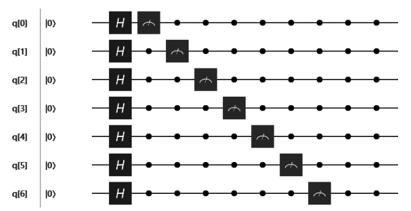
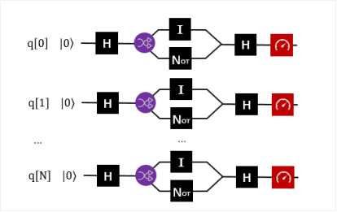
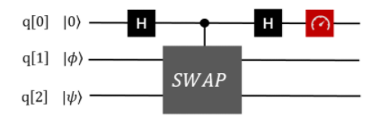

# 欢迎来到量子的世界

**Welcome To The World Of Quantum**

## 简介

  量子云计算平台是一个主要基于真实量子芯片的云计算服务，它是一个开放的平台，任何人都可以从这个平台获取以下服务：

量子语言编译


图形化量子计算编辑器


量子仿真计算


真实量子计算机

  不论你是系统学习过量子计算的研究者，还是对“量子”一知半解甚至一无所知的门外汉，本教程都能为你提供一定的帮助。

  我们将从量子力学的基本概念讲起，去粗取精，力求用最简单的语言阐明量子计算的基本理论。若是你具备简单的矩阵运算基础，那么我们相信你是能完全读懂本教程的。

| **量子力学的简介**   |                                                              |
| -------------------- | ------------------------------------------------------------ |
| **量子力学基本概念** | 这一部分中介绍了量子计算中需要用到的量子力学知识。我们将线性代数的知识迁移到量子力学中，使用矩阵表示量子态。 |
| **量子计算基本原理** | 这一部分中介绍我们是如何把量子力学应用在量子计算上的。主要介绍了量子逻辑门和量子线路的概念。 |
| **介绍几种量子算法** | 我们会介绍量子计算中最基础的算法                             |

## FAQ

**什么是量子计算机？**
  量子计算机是由量子芯片（类比经典计算机中的CPU，如Intel Core i9-7900X）和外部测控系统（类比主板如Intel X299 Chipset）构成的计算系统。量子芯片是基于量子力学原理，以量子比特（类比高低电平）为基本单位构成的。量子比特是由一个物理系统的两个能级所构成的。量子比特的行为遵循量子规律。


**为什么要研究量子计算机？**
  最直接的理由：快！它是目前人类提出来的一个不同于冯·诺依曼体系的计算模型。由于量子态的叠加、纠缠等性质，使得这种计算模型理论上拥有指数级别的计算能力。自从P. Shor提出Shor算法，表明量子计算机能在有效时间内攻击RSA密钥体系之后，量子计算机的实现就一直是热门的研究方向。

**量子计算机是如何制造出来的？**
  不同于绝大多数基于硅的经典计算机，在各种各样的体系之中，各个研究组都在尝试量子计算机的实现。这里面有离子阱、线性光学系统、超导体系、半导体体系等等。每一种都有其特殊的制造方法。但是无论哪一种，现在都只制造出来了少量量子比特的体系，离真正完整的通用量子计算机还有很大距离。

# 量子世界

**Quantum World**

对于一个非物理专业的人而言，量子力学概念复杂且难学。有一个好消息是，我们只用去了解量子力学的一些简单概念加上一点数学的东西，甚至说不用理解薛定谔方程，就可以开始量子计算机的应用。这就像我们不用去了解CPU的工作原理，但是我们也能日常使用或者编写程序一样。

这一章里面会彻底抛弃数学公式，仅仅去介绍宽泛的概念，目的只是让人能无障碍地了解“量子究竟是什么”。在人类能触及的世界中，仰观孕育文明的地球之外，是宏观的广阔宇宙，而俯察难以细分极度微小的原子间，还有着另一片奇伟瑰怪的世界

如果对量子相关的物理知识不感兴趣，而且有较好的线性代数基础，那么可以直接跳入下一章进行量子计算相关知识的学习。

## 量子态

**Quantum State**

简而言之，量子态就是一个微观粒子的状态。

我们描述一个粒子的状态时，总要找一些能够用来区分微观粒子的属性。就比如说我在一栋楼的1楼，就叫做“1态”，在2楼，就叫做“2态”，在地下一层，就叫做“-1态”，依次类推。微观粒子也有这样的属性，比如它的位置。

但是有时候，我正在上楼梯，进入到一个模糊的状态，这样我们就不太容易区分我到底是在“1态”还是“2态”，这时候我们需要找一些客观实在的参数去描述这一方面的属性，比如我所处的海拔。通常，在我们的日常生活中，这些描述都是连续的，因为这些参数能被分割成更小的部分。

然而，无限分割下去，到了我们不得不靠“几个原子”这种单位去描述物体的长度时，量子效应就出场了。薛定谔方程告诉我们，我们一定会遇到不可分割的最小单位。这种最小单位，我们统称为量子，这种现象，我们称为**量子化**。这是量子的**第一个特性**。

量子化的属性有很多种。但是这里我们先只考虑一个——能量。人们探索得知，原子的光谱只会有几个峰值，而不是连续的谱线，这代表了原子内电子的能量只会出现几种情况，电子不可能具有几种情况之外的中间值，这就是能量的量子化。每一种能量，我们称之为一个“**能级**”。

继续以一栋楼作为例子，在微观的世界里面，这栋楼的楼梯被拆掉了，这使得我要么在一楼，要么在二楼，只能在整数的楼层。但是，这不代表我就失去了上下楼的手段。这里就是量子的**第二个特性——跃迁**。

当一个原子中的电子获得了来自原子外的能量时，它就有可能克服能级之间能量的差距，跳到另外一个态上面。当然这个电子也可以将自己的能量释放出来，跳到能量较低的能级上面。当然，能级本身是稳定的，不管怎么跃迁，电子的能量都只能处在这几个能级上，这是原则。

  最后，回到这一节的标题。什么是量子态呢？想象一下电子处在不同的楼层上面，我们给这些楼层命名称之为|1F\rangle,|2F\rangle，|3F\rangle …∣1*F*⟩,∣2*F*⟩，∣3*F*⟩…，这样就可以区分出来不同的量子态。能想象到这种情形，你已经明白了什么是量子态了。尽管真实情况比我所说的复杂多了，但是至少现在，这些足矣。

## 量子叠加性

**Quantum Superposition**

如果只是把能级建成大楼，然后把大楼的楼梯、电梯全拆掉，（并且不问为什么会这样的话，）这件事情倒也不难理解。然而接下来的部分，我们就没办法用一般的现实去想象了。

**量子叠加性**是量子的**第三个特性**。不管是出于什么契机，你大概应该听说过薛定谔的猫这个故事。故事的最后告诉我们：猫处于生与死的叠加态。什么是生与死的叠加态？既生又死？人间与冥界的夹缝之间？实际上这个故事是关于量子叠加性的一个有争议的思想实验。在解释这个故事之前，我们要先解释一点量子的东西。

首先，我们必须接受一个概念，就是量子的世界里面，同时存在几个状态是可能的。就像这栋楼里面的每个人，在不去观察他们时，他们就在所有楼层同时存在。这就是量子叠加性。

糟糕！写到这里时，我注意到这个比喻不是那么恰当。就算在现实生活中，我们也没法知道一栋大楼里面任何一个人的位置，最多知道他在办公桌上坐着的概率比较大而已。那是不是这样就是量子叠加性呢？很遗憾，并不是。量子叠加不是一种“概率性”存在，事实上，对于量子本身，它就是“同时存在”于很多状态的叠加上。

尽管这个概念多么的古怪、反直觉、难以置信，但是我不想和任何人有哲学上的辩论，而是希望你能承认它是对的。我们的量子计算机就是建立在这个原理之上。此外，无数的实验证明，当物体小到分子原子电子那个级别的时候，叠加是客观存在的，尽管没有人知道为什么。

为什么我们感受不到叠加性？如果每个粒子都有这种叠加性，那是不是作为粒子组合的人也应该具有叠加性呢？

并不是。因为我们是由一个巨大的量的粒子构成的集合体。一个粒子虽然是叠加的，但是一群粒子就能开始体现统计的平均性。就像我们连续扔一百次硬币，还是稍微有可能出现全部是正面的情况。但是扔一亿次硬币的时候，（如果你不在硬币上面做手脚，）我们会得到一个趋于稳定的结果——正反面各一半。何况我们每个人身体里的粒子比一亿还要多几亿倍的几亿倍（差不多有27 ∼ 28位数那么多）。所以我们是绝无可能有叠加性的。

## 测量和坍缩

**Measurement And Collapse**

薛定谔宣称，不打开盒子，猫就处于生和死的“叠加态”（关于叠加态上面已经提到过了）。之后，他下一句话是：“当我们打开盒子，经过了我们的观察，猫就会坍缩到一个确定的生、死状态上”。

事情又变得麻烦了。什么叫做“观察”之后“坍缩”到确定的状态上？难道不是这个装置而是第一个看到猫的人决定了猫的生死吗？

这里我们就要提出量子的**第四个特性**：“**测量和坍缩假设**”。测量和坍缩对量子态的影响仍然是一个争议话题，所以我这里用了“假设”。这个特性的描述如下：

对于一个叠加态而言，我们可以去测量它。测量的结果一定是这一组量子化之后的，确定的，分立的态之中的一个。测量得到任意的态的概率是这个叠加态和测量态的内积的平方。测量之后，叠加态就会坍缩到这个确定的态之上。

尽管看起来复杂，但简单的来说就是如果在一个人处在1楼和2楼叠加态的话，我们只能测出来他在1楼或者2楼，这个概率是由他们的叠加权重决定的。但是一旦我测出来之后，他就不再是原来那个既在1楼又在2楼的他了，而是处在一个确定的状态（1楼或者2楼）。我们的测量影响了这个粒子本身的状态。

如果看了上面一节，你已经接受了叠加本身是一种客观存在的事情了。那么测量、观察这种主观的事情是如何影响到客观的叠加的？可能你又会一头雾水了。

比较主流的理论是说因为微观粒子太小，测量仪器本身会对这个粒子产生一定的影响，导致粒子本身发生了变化。但是我们没有足够的证据证明这种说法。

回到薛定谔的猫上面来。薛定谔之所以提出这个思想实验，是想让宏观事物——猫，和微观事物——放射性原子建立“纠缠”，从而把量子力学的诡异现象从微观世界引到现实世界中来。“如果我们承认微观粒子具有这些“叠加“、”坍缩“的性质的话，那猫也具有了”——这是薛定谔的思想。关于这个问题，也没有确切的证据证明猫不是处于这样的状态。

# 量子力学

**Quantum Mechanics**

  我个人认为，如果要去理解量子计算本身的东西，数学的东西是逃不掉的。在前面一章里面，我只展现了量子世界的许多古怪性质。其实我们处理实际的量子计算问题的时候，不需要在这些问题上面追根问底。这一章里面，我会用数学的方式去将第一章里面的内容重新表述一遍。此时，我会假定读者拥有一定的数理基础，包括矢量概念，复数运算i^2=-1*i*2=−1，简单的概率论；如果你对于矩阵运算的方法（行矢量、列矢量、矩阵转置、矩阵乘法）很熟悉的话，那当然更好。

## 态矢

**State Vector**

**量子态的态矢描述**

右矢

|\psi\rangle=[c_1,c_2,\cdots,c_n]^T,∣*ψ*⟩=[*c*1,*c*2,⋯,*c**n*]*T*,

左矢

\langle\psi |=[c^*_1,c^*_2,\cdots,c^*_n],⟨*ψ*∣=[*c*1∗,*c*2∗,⋯,*c**n*∗],

  我们采用竖线和尖括号的组合描述一个量子态，其中每一个分量都是复数，右上角标T表示转置。这样的描述表示量子态是一个矢量。右矢表示一个 1\times n1×*n* 的列矢量，左矢表示一个 n\times1*n*×1 的行矢量。另外，在讨论同一个问题时，如果左矢和右矢在括号内的描述相同的话，那么这两个矢量互为转置共轭。

**内积和外积**
  对于任意的两个量子态

|\alpha\rangle=[a_1,a_2,\cdots,a_n]^T,|\beta\rangle=[b_1,b_2,\cdots,b_n]^T,∣*α*⟩=[*a*1,*a*2,⋯,*a**n*]*T*,∣*β*⟩=[*b*1,*b*2,⋯,*b**n*]*T*,

内积

\langle\alpha|\beta\rangle=\sum^n_i a_ib_i=c,⟨*α*∣*β*⟩=∑*i**n**a**i**b**i*=*c*,

外积

|\alpha\rangle\langle\beta|=(a_ib_j)_{i,j}=C^{n\times n},∣*α*⟩⟨*β*∣=(*a**i**b**j*)*i*,*j*=*C**n*×*n*,

## 叠加态和测量

**Superposition State And Measurement**

  两个矢量|0\rangle,|1\rangle∣0⟩,∣1⟩可以构成二维空间的一组基。任何一个态矢都可以写为这组基在复数空间上的线性组合，即

|\psi\rangle=\alpha|0\rangle+\beta e^{i\theta}|1\rangle,∣*ψ*⟩=*α*∣0⟩+*β**e**i**θ*∣1⟩,

  其中 e^{i\theta}*e**i**θ* 表示模为11幅角为 \theta*θ* 的复数。

  我们现在就可以给测量这件事情赋予数学上的含义了。定义测量就是将量子态|\psi\rangle∣*ψ*⟩投影到另一个态 |\alpha\rangle∣*α*⟩上。获得这个态的概率是它们内积的平方，即P_{\alpha}=|\langle\psi|\alpha\rangle|^2,*P**α*=∣⟨*ψ*∣*α*⟩∣2,

  其它概率下会将量子态投影到它的正交态上面去，即

P_{\alpha_\perp}=1-P_{\alpha}.*P**α*⊥=1−*P**α*.

  测量之后量子态就坍缩到测量到的态上面。

## 相位、纯态和混合态

Phase, Pure State and Mixed State

  如果说我们有办法将量子态初始化到某一个未知的叠加态上面，我们能否通过反复的测量得到它的表达式呢？看下面这种两种情况：

|\psi_1\rangle=\frac{1}{\sqrt{2}}(|0\rangle+|1\rangle),\\ |\psi_2\rangle=\frac{1}{\sqrt{2}}(|0\rangle-|1\rangle),∣*ψ*1⟩=21(∣0⟩+∣1⟩),∣*ψ*2⟩=21(∣0⟩−∣1⟩),

  我们会发现在|0\rangle,|1\rangle∣0⟩,∣1⟩的方向上测量，它们的表现都是一半概率为00，一半概率为11，根本不能区分。

  这里我只是想提醒你相位是某种隐含的信息，从概率上无法表示的信息。实际上，量子态的相位是量子相干性的体现。关于量子相干性的更详细信息我会在接下来的部分介绍。

  现在我们再来介绍另一种情况。想象我们左手抓着一个袋子，这个袋子里面有无数的量子态。他们全部都是|\psi_1\rangle=\frac{1}{\sqrt{2}}(|0\rangle+|1\rangle)∣*ψ*1⟩=21(∣0⟩+∣1⟩)这种叠加态。另外我们有一个机器可以在|0\rangle,|1\rangle∣0⟩,∣1⟩ 的方向上测量。

  我们每次拿出来一个态，对它进行测量，不管它是|0\rangle∣0⟩还是|1\rangle∣1⟩，都扔到右手边的另一个袋子里面。反复这个过程，这样右边袋子里面的态越来越多了。因为我们的测量结果对于这两种情况是等概率的，所以右边的袋子里面约有一半的态是|0\rangle∣0⟩，另一半是|1\rangle∣1⟩。

  我们从右手边的袋子里面取一个出来。在我们不知道手上的这个态是什么的情况下，我们能说它和左手边袋子里面的态一样都是|\psi_1\rangle=\frac{1}{\sqrt{2}}(|0\rangle+|1\rangle)∣*ψ*1⟩=21(∣0⟩+∣1⟩)吗？

  答案是不能。右边袋子里面的态实际上是一种经典的概率叠加，和等量的红球白球装在袋子里面一样。这样的态是不具有相位的。它只能表示为

P(|\psi\rangle=|0\rangle)=0.5,\\ P(|\psi\rangle=|1\rangle)=0.5,*P*(∣*ψ*⟩=∣0⟩)=0.5,*P*(∣*ψ*⟩=∣1⟩)=0.5,

这种类似于概率列表的形式。

  所以说，我们定义纯态就是“纯粹的量子态”，它不仅具有概率，还具有相位（也就是量子相干性）。混合态是纯态的概率性叠加，它往往失去了（部分或全部的）相位信息。

## 密度矩阵和布洛赫球

**Density Matrix And Bloch Sphere**

  态矢是对纯态的描述，如果要描述一个混合态，就必须写成态集合和概率的列表形式，这样非常繁琐。所以我们采用密度矩阵来描述。

  对于一个纯态|\psi\rangle∣*ψ*⟩而言，密度矩阵可以写为：

\rho=|\psi\rangle\langle\psi|,*ρ*=∣*ψ*⟩⟨*ψ*∣,

  而对于一个混合态|\psi\rangle∣*ψ*⟩而言，密度矩阵的形式是：

\rho=\sum_i P_i|\psi_i\rangle\langle\psi_i|,*ρ*=∑*i**P**i*∣*ψ**i*⟩⟨*ψ**i*∣,

  其中{P_i,|\psi_i\rangle}*P**i*,∣*ψ**i*⟩ 是系统所处的态及其概率。

密度矩阵有以下的性质：

- **对于一个两能级体系表述的态，不论是纯的还是混合的，都可以用密度矩阵\rho\*ρ\*表示。**
- **\rho = \rho^2\*ρ\*=\*ρ\*2当且仅当量子态时纯态时成立。**
- **\rho\*ρ\*对角线上的分量表示整个系统如果经历一次测量，那么得到这个态的概率。**
- **我们如果只去操作和测量一个两能级体系，那么我们是分辨不出相同的密度矩阵的。**

  密度矩阵已经完备地表示了一个两能级系统可能出现的任何状态。为了更加直观地理解量子叠加态与逻辑门的作用，引入布洛赫球的概念，它能够方便的表示一个量子比特的任意状态。


  如果量子态是一个纯态，那么它是球面上的点。点的z*z*坐标衡量了它的|0\rangle∣0⟩和|1\rangle∣1⟩的概率，即

P(0)=\frac{1+z}{2},\\ P(1)=\frac{1-z}{2}.*P*(0)=21+*z*,*P*(1)=21−*z*.

  所以最上面表示|0\rangle∣0⟩态，最下面表示|1\rangle∣1⟩态。

  再沿着平行于XY平面的方向，并且穿过这个点的Z坐标，可以得到一个圆。这个圆就象征着相位的复平面。所以这个点在这个圆上交X轴的角度就是单位复数的幅角。经过这个过程我们将每个纯态都与球面上的点一一对应了起来。

  对于混合态而言，因为根据我们之前的描述，混合态实际上是多个纯态的经典统计概率的叠加。对于每一个纯态分量，我们连接球心和球面上的点，可以形成一个矢量。我们根据概率列表，对所有的纯态矢量进行加权平均，即可得到混合态的矢量，即得到了混合态对应的点。

  混合态是球内部的点，根据混合的程度不同，矢量的长度也不同。最大混合态是球心。它意味着这里不存在任何量子叠加性。

  例如(1,0,0)(1,0,0)和(-1,0,0)(−1,0,0)点在布洛赫球上就是在X方向上的顶点和-X方向上的顶点。我们根据刚才的叙述，知道它们对应的量子态的概率分布就是Z坐标，即为00。所以，

P_0(|\psi_1\rangle)=P_0(|\psi_2\rangle)=0.5,*P*0(∣*ψ*1⟩)=*P*0(∣*ψ*2⟩)=0.5,

  沿XY平面横切，得到一个圆，我们可以看到这两个点对应的幅角是\theta_1=0,\theta_2=\pi*θ*1=0,*θ*2=*π*，所以我们就可以推断出来量子态分别为

|\psi\rangle_1=\frac{1}{\sqrt{2}}(|0\rangle+|1\rangle),\\ |\psi\rangle_2=\frac{1}{\sqrt{2}}(|0\rangle-|1\rangle),∣*ψ*⟩1=21(∣0⟩+∣1⟩),∣*ψ*⟩2=21(∣0⟩−∣1⟩),

  如果将这两个态以1/2,1/21/2,1/2的概率混合，在布洛赫球上面的坐标将表示为(0,0,0)(0,0,0)，也就是球心。对应到密度矩阵的表述，即为

\rho=\frac{1}{2}|\psi_1\rangle\langle\psi_1|+\frac{1}{2}|\psi_2\rangle\langle\psi_2|=\begin{vmatrix} 0.5&0 \\ 0& 0.5 \end{vmatrix}*ρ*=21∣*ψ*1⟩⟨*ψ*1∣+21∣*ψ*2⟩⟨*ψ*2∣=∣∣∣∣∣0.5000.5∣∣∣∣∣

即为最大混合态。

# 量子计算原理

**Theory of Quantum Computing**

  我们在此之前所铺垫的概念，都是为了说明一个量子比特具有的性质。那么，接下来的部分，我们会通过量子逻辑门来对量子态进行操作。

  经典计算中，最基本的单元是比特，而最基本的控制模式是逻辑门。我们可以通过逻辑门的组合来达到我们控制电路的目的。类似地，处理量子比特的方式就是量子逻辑门。使用量子逻辑门，我们有意识的使量子态发生演化。所以量子逻辑门是构成量子算法的基础。

## 酉变换

**Unitary Transformation**
  酉变换是一种矩阵，也是一种操作。它作用在量子态上得到的是一个新的量子态。使用U*U* 来表达酉矩阵，U^\dagger*U*†表示酉矩阵的转置复共轭矩阵。二者满足运算关系UU^\dagger=I*U**U*†=*I*，所以酉矩阵的转置复共轭矩阵也是一个酉矩阵，说明酉变换是一种可逆变换。

  一般酉变换在量子态上的作用是变换矩阵左乘以右矢进行计算的。 举个例子，例如一开始有一个量子态|\psi_0\rangle∣*ψ*0⟩，经过酉变换U*U*之后得到|\psi\rangle=U|\psi_0\rangle,∣*ψ*⟩=*U*∣*ψ*0⟩,或者也可以写为\langle\psi|=\langle\psi_0|U^\dagger。⟨*ψ*∣=⟨*ψ*0∣*U*†。

  所以说两个矢量的内积经过同一个酉变换之后保持不变，即：

\langle\varphi|\psi\rangle=\langle\varphi|U^\dagger U|\psi\rangle,⟨*φ*∣*ψ*⟩=⟨*φ*∣*U*†*U*∣*ψ*⟩,

  类似地，我们也可以通过酉变换表示密度矩阵的演化：

\rho=U\rho_0 U^\dagger,*ρ*=*U**ρ*0*U*†,

  这样就连混合态的演化也包含在内了。

**矩阵的指数**

  一旦我们定义了矩阵乘法，我们可以利用函数的多项式展开来定义矩阵的函数。这其中就包含矩阵的指数形式。如果A是一个矩阵，

\exp{A}=1+A+\frac{A^2}{2!}+\frac{A^3}{3!}+\cdots,exp*A*=1+*A*+2!*A*2+3!*A*3+⋯,

  如果A是一个对角矩阵，

A=\text{diag}(A_{11},A_{22},A_{33},\cdots),*A*=diag(*A*11,*A*22,*A*33,⋯),

  可以容易验证

A^n=\text{diag}(A^n_{11},A^n_{22},A^n_{33},\cdots),*A**n*=diag(*A*11*n*,*A*22*n*,*A*33*n*,⋯),

  从而得到

\exp(A)=\text{diag}(e^{A_{11}},e^{A_{22}},e^{A_{33}},\cdots),exp(*A*)=diag(*e**A*11,*e**A*22,*e**A*33,⋯),

  如果$A$不是一个对角矩阵，我们利用酉变换可以将它对角化，D=UAU^\dagger*D*=*U**A**U*†，从而有

A^n=UD^nU^\dagger,*A**n*=*U**D**n**U*†,

  那么，类似地

\exp(A)=U\exp(D)U^\dagger,exp(*A*)=*U*exp(*D*)*U*†,

  必须要引起注意的是

\exp(A+B)\neq\exp(A)\exp(B)\neq\exp(B)\exp(A),exp(*A*+*B*)=exp(*A*)exp(*B*)=exp(*B*)exp(*A*),

  通常，我们称下面这种形式是以A*A*为生成元生成的酉变换

U(\theta)=\exp(-i\theta A),*U*(*θ*)=exp(−*i**θ**A*),

  以后会经常遇到这种矩阵的指数运算。除了上面的方法之外，你也可以利用Matlab中的expm，或者Mathematica中的MatrixExp命令进行方便地计算。

**单位矩阵**

以单位矩阵为生成元，可以构建一种特殊的酉变换。

u(\theta)=\exp(-i\theta I)=\begin{pmatrix} e^{-i\theta}&0 \\ 0& e^{-i\theta} \end{pmatrix}=\exp(-i\theta )I*u*(*θ*)=exp(−*i**θ**I*)=(*e*−*i**θ*00*e*−*i**θ*)=exp(−*i**θ*)*I*

  它作用在态矢上面，相当于对于态矢整体（或者说每个分量同时）乘以了一个系数。如果将这种态矢带入到密度矩阵的表达式中，会发现这一项系数会被消去。

  这个系数称为量子态的整体相位。因为任何操作和测量都无法分辨两个相同的密度矩阵，所以量子态的整体相位一般情况下是不会对系统产生任何影响的。

## 泡利矩阵和单比特量子逻辑门

**Pauli Matrices And Single Qubit Quantum Logic Gates**
  泡利矩阵有三个，分别是

\sigma_x=\begin{pmatrix}0&1\\1&0\end{pmatrix},\sigma_y=\begin{pmatrix}0&-i\\i&0\end{pmatrix},\sigma_z=\begin{pmatrix}1&0\\0&-1\end{pmatrix},*σ**x*=(0110),*σ**y*=(0*i*−*i*0),*σ**z*=(100−1),

  三个泡利矩阵所表示的泡利算符代表着对量子态矢量最基本的操作。如将\sigma_x*σ**x*作用到|0\rangle∣0⟩态上，经过矩阵运算，得到的末态为|1\rangle∣1⟩态。泡利矩阵的线性组合是完备的二维酉变换生成元，即所有满足UU^\dagger=I*U**U*†=*I*的U*U*都能通过下面这种方式得到

U=e^{-i\theta(a\sigma_x+b\sigma_y+c\sigma_z)},*U*=*e*−*i**θ*(*a**σ**x*+*b**σ**y*+*c**σ**z*),

  在经典范畴，单比特的门只有一种——非门。但是量子比特情况更为复杂，存在叠加态、相位，所以单比特门会有更加丰富的种类。

**Hadamard门**

  Hadamard是一种基础的建立叠加态的单比特门。它具有如下的矩阵形式：

H=\frac{1}{\sqrt{2}}\begin{pmatrix}1&1\\1&-1\end{pmatrix},*H*=21(111−1),

  它能把|0\rangle∣0⟩变为\frac{1}{\sqrt{2}}(|0\rangle+|1\rangle)21(∣0⟩+∣1⟩)，把|1\rangle∣1⟩变为\frac{1}{\sqrt{2}}(|0\rangle-|1\rangle)21(∣0⟩−∣1⟩)。

  实际上也可以说Hadamard门是由\sigma_x+\sigma_z*σ**x*+*σ**z*矩阵生成的。

**RX,RY,RZ门**

  分别用不同的泡利矩阵作为生成元是构成RX,RY,RZ的方法。

RX(\theta)=e^{-i\theta\sigma_x/2}=\begin{pmatrix}\cos(\theta/2)&-i\sin(\theta/2)\\-i\sin(\theta/2)&\cos(\theta/2)\end{pmatrix},\\ RY(\theta)=e^{-i\theta\sigma_y/2}=\begin{pmatrix}\cos(\theta/2)&-\sin(\theta/2)\\\sin(\theta/2)&\cos(\theta/2)\end{pmatrix},\\ RZ(\theta)=e^{-i\theta\sigma_z/2}=\begin{pmatrix}e^{-i\theta/2}&0\\0&e^{i\theta/2}\end{pmatrix}.\\*R**X*(*θ*)=*e*−*i**θ**σ**x*/2=(cos(*θ*/2)−*i*sin(*θ*/2)−*i*sin(*θ*/2)cos(*θ*/2)),*R**Y*(*θ*)=*e*−*i**θ**σ**y*/2=(cos(*θ*/2)sin(*θ*/2)−sin(*θ*/2)cos(*θ*/2)),*R**Z*(*θ*)=*e*−*i**θ**σ**z*/2=(*e*−*i**θ*/200*e**i**θ*/2).

  RX,RY,RZ*R**X*,*R**Y*,*R**Z*意味着将量子态在布洛赫球上分别绕着X,Y,Z轴旋转\theta*θ*角度。所以说RX，RY能带来概率幅的变化，而RZ只有相位的变化。共同使用这三种操作能使量子态在整个布洛赫球上自由移动。

## 两比特量子逻辑门

**Two Qubit Quantum Logic Gates**

  不论是在经典计算还是量子计算中，两比特门无疑是建立比特之间的联系的最重要桥梁。不同于经典计算中的与或非门及他们的组合，量子逻辑门要求所有的逻辑操作必须是酉变换。所以输入和输出的比特数量是相等的。

  在描述两比特门之前，我们必须要将之前对于比特的表示方式扩展一下。我们联立两个比特的时候，采用直积的方式合成一个新的量子态，即

|\psi_1\rangle_{Q1}\otimes|\psi_2\rangle_{Q2}=\begin{pmatrix}\alpha_1\\\beta_1 e^{i\phi_1}\end{pmatrix}\otimes\begin{pmatrix}\alpha_2\\\beta_2 e^{i\phi_2}\end{pmatrix} =\begin{pmatrix}\alpha_1\alpha_2\\\alpha_1\beta_2 e^{i\phi_2}\\\alpha_2\beta_1 e^{i\phi_1}\\\beta_1\beta_2 e^{i(\phi_1+\phi_2)}\end{pmatrix}.∣*ψ*1⟩*Q*1⊗∣*ψ*2⟩*Q*2=(*α*1*β*1*e**i**ϕ*1)⊗(*α*2*β*2*e**i**ϕ*2)=⎝⎜⎜⎜⎛*α*1*α*2*α*1*β*2*e**i**ϕ*2*α*2*β*1*e**i**ϕ*1*β*1*β*2*e**i*(*ϕ*1+*ϕ*2)⎠⎟⎟⎟⎞.

  下标表示描述了第几个量子比特上的状态。运算规则很简单，就是按照顺序把两个量子态上的分量乘在一起作为新的列矢量的分量即可。新的列矢量的维度等于直积之前两个矢量的维度之积。新的系统就包含了两个比特的所有状态。

  那么对于一个两比特的系统，构成它的基就是每个比特各自的基的直积，

|0\rangle_{Q_1Q_2}=|00\rangle=|0\rangle_{Q1}\otimes|0\rangle_{Q2},\\ |1\rangle_{Q_1Q_2}=|01\rangle=|0\rangle_{Q1}\otimes|1\rangle_{Q2},\\ |2\rangle_{Q_1Q_2}=|10\rangle=|1\rangle_{Q1}\otimes|0\rangle_{Q2},\\ |3\rangle_{Q_1Q_2}=|11\rangle=|1\rangle_{Q1}\otimes|1\rangle_{Q2}.∣0⟩*Q*1*Q*2=∣00⟩=∣0⟩*Q*1⊗∣0⟩*Q*2,∣1⟩*Q*1*Q*2=∣01⟩=∣0⟩*Q*1⊗∣1⟩*Q*2,∣2⟩*Q*1*Q*2=∣10⟩=∣1⟩*Q*1⊗∣0⟩*Q*2,∣3⟩*Q*1*Q*2=∣11⟩=∣1⟩*Q*1⊗∣1⟩*Q*2.

  单比特门在两比特系统下的表示可以写为U=U_1\otimes U_2,*U*=*U*1⊗*U*2,其中U_1*U*1 和U_2*U*2表示在第一个或第二个比特上各自的操作。注意，U_1\otimes U_2\neq U_2\otimes U_1*U*1⊗*U*2=*U*2⊗*U*1，所以比特的顺序一旦决定，就不可发生改变。

  在这个基础上，我们可以介绍一些对两比特共同进行操作的量子逻辑门。

**控制非门**

  控制非门(Control-NOT)，通常用\text{CNOT}CNOT进行表示，是一种普遍使用的两比特门。它具有如下的矩阵形式

\text{CNOT}=\begin{pmatrix}1&0&0&0\\0&1&0&0\\0&0&0&1\\0&0&1&0\end{pmatrix},CNOT=⎝⎜⎜⎜⎛1000010000010010⎠⎟⎟⎟⎞,

它的含义是当控制比特为00状态时，目标比特不发生改变；当控制比特为11状态时，使目标比特做非操作（或者也可以说是RX(\pi)*R**X*(*π*)）操作。要注意的是控制比特和目标比特的地位是不能交换的。

**控制相位门**

  控制相位门和控制非门类似，通常记为\text{CR(CPhase)}CR(CPhase)，只不过当控制比特为1状态时，目标比特做RZ操作。

\text{CR}(\theta)=\begin{pmatrix}1&0&0&0\\0&1&0&0\\0&0&1&0\\0&0&0&e^{-i\theta}\end{pmatrix},CR(*θ*)=⎝⎜⎜⎜⎛100001000010000*e*−*i**θ*⎠⎟⎟⎟⎞,

  稍微有点特殊的是，控制相位门例交换控制比特和目标比特的角色，矩阵形式不会发生任何改变。

**iSWAP门**

  iSWAP门的主要作用是交换两个比特的状态，并且给他们赋予\pi/2*π*/2相位。经典电路中也有SWAP门，但是iSWAP是量子计算中特有的。iSWAP门在某些体系中是较容易实现的两比特逻辑门，它是由\sigma_x\otimes\sigma_x+\sigma_y\otimes\sigma_y*σ**x*⊗*σ**x*+*σ**y*⊗*σ**y*作为生成元构成的。

\text{iSWAP}(\theta)=\begin{pmatrix}1&0&0&0\\0&\cos(\theta/2)&i\sin(\theta/2)&0\\0&i\sin(\theta/2)&\cos(\theta/2)&0\\0&0&0&1\end{pmatrix},iSWAP(*θ*)=⎝⎜⎜⎜⎛10000cos(*θ*/2)*i*sin(*θ*/2)00*i*sin(*θ*/2)cos(*θ*/2)00001⎠⎟⎟⎟⎞,

  通常我们会用一个完整的翻转，即\theta=\pi*θ*=*π*的情况来指代iSWAP。当角度为iSWAP的一半时，即\theta=\pi/2*θ*=*π*/2，我们称之为\sqrt{\text{iSWAP}}iSWAP 。

  对于iSWAP门而言，两个比特之间是地位对等的，不存在控制和受控的关系。

## 量子线路

**Quantum Circuit**

  现在我们可以把这些门组合起来形成量子的线路了。对于一系列的酉变换而言，它其实就相当于对初始的量子态按次序进行左乘操作，即

|\psi\rangle_{末态}=U_nU_{n-1}\cdots U_2U_1|\psi\rangle_{初始},∣*ψ*⟩末态=*U**n**U**n*−1⋯*U*2*U*1∣*ψ*⟩初始,

  对于矩阵乘法而言，一般不具备可交换性，所以我们最先对量子态进行的操作是U_1*U*1，之后是U_2,\cdots*U*2,⋯，最后是U_n*U**n*。

  对于我们的界面而言，每一条线代表一个量子比特。最左边定义了初始的状态。然后从左至右表示了酉变换的操作顺序。通常一个完整的量子线路上面不会只有一个量子比特。除了单比特操作之外，也会有跨越两个比特的双比特逻辑门操作符号。比如图中的\text{CNOT}CNOT。

  线路的最后将会有测量的图标。一个完全没有测量的电路是没有意义的。投影测量会按照量子态的概率分量随机得到00或者11。

## 保真度和退相干

**Fidelity And Decoherence**

**保真度**

不像经典电路中，高电平具有一定的容忍值。叠加态上每个分量的叠加概率是个连续量，所以不可避免的，任何操作都会存在误差。

我们可以同样通过测量（或者内积）来定义量子态的保真度。如果我们想操作一个态到|0\rangle∣0⟩，实际上却操作到了\sqrt{0.999}|0\rangle+\sqrt{0.001|1\rangle}0.999∣0⟩+0.001∣1⟩，这样我们在|0\rangle∣0⟩方向上测量时，只有99.9\%99.9%的概率得到正确的结果。我们定义F=|\langle\psi|\phi\rangle|^2*F*=∣⟨*ψ*∣*ϕ*⟩∣2为|\psi\rangle∣*ψ*⟩相对|\phi\rangle∣*ϕ*⟩的保真度。
保真度是衡量量子线路质量的最主要参量。

**退相干**

  退相干是导致保真度下降的主要原因。存在两种退相干机制

  第一，振幅退激发。就像水往低处流的道理一样，量子态的高能态不是那么稳定，而是存在向低能态缓慢退激发的过程。这种现象又称为弛豫过程。

  弛豫过程在密度矩阵上面表现为ρ22项的指数衰减，由于总概率为11,ρ11在相对提高。

\left\{\begin{matrix} \rho_{22}(t)&=&\rho_{22}(0)e^{-t/T_1}, \\ \rho_{11}(t)&=&1-\rho_{22}(t). \end{matrix}\right.{*ρ*22(*t*)*ρ*11(*t*)==*ρ*22(0)*e*−*t*/*T*1,1−*ρ*22(*t*).

  第二，相位退相干。之前提到过混合态就是失去了部分或者全部相位信息的量子态。因为噪声的影响，会造成量子态本身的经典统计上的分裂。从而导致相位的丢失。
退相干在密度矩阵上表现为非对角项的指数衰减。

\left\{\begin{matrix} \rho_{21}(t)&=&\rho_{21}(0)e^{-t/T_2}, \\ \rho_{12}(t)&=&\rho^*_{21}(t). \end{matrix}\right.{*ρ*21(*t*)*ρ*12(*t*)==*ρ*21(0)*e*−*t*/*T*2,*ρ*21∗(*t*).

  这两个过程都会以一种随时间指数衰减的模式导致量子信息流失到外界。其中T_1,T_2*T*1,*T*2就是描述这两个过程所使用的参量。它们越大意味着量子信息的保存时间越长，原则上在整个量子线路中所消耗的总时间不应该超过这两个参量中的任何一个。

# 随机数生成器

**Random Number Generator**
  随机数的制备相对来说是简单的。我们知道，现在计算机生产的随机数，其实并非真正的随机数。经典随机数可以理解为一个函数的输入和输出。 在经典计算当中，所得的随机数是由一个函数所产生，意味着如果人们知道输入，就能预测得到输出。但是量子随机数是 真随机（Truly Random），得益于量子测量结果的不可预测性，也即是量子测量的输出是不可预测的，完全随机分布。那量子态编码的输出，自然就是真随机数了。
  简单思路，随机数的制备其实就是对叠加态的测量。测量后得到的随机数就是真随机数。也可以通过少量 的量子位测量然后搜集输出结果，以此来制备随机源。比如，制备00到127127中的一个随机数，这里提供一个简单思路。

## 参考线路图：



## 参考代码：

```
void random_number(){ auto qvm = CPUQVM(); qvm.init(); QProg random = CreateEmptyQProg(); QVec qbit = qvm.qAllocMany(7); random << applySingleGateToAll("H", qbit);; auto result = qvm.probRunDict(random, qbit, 1<<qbit.size()); qvm.finalize(); for (auto &aiter : result) {     cout << aiter.first << " : " << aiter.second << endl; }}
```

# Deutsch-Jozsa Algorithm

  通常，开发量子计算的主要驱动力来源于量子计算相较于经典计算体现的优越性。通常也是从这样的比较里来认识量子计算。通过简单直观的对比，来扣住“量子霸权”真正含义所在，下面就从简单Deutsch问题说起。

## 问题描述

  考虑函数：

f:\{0,1\}^n\rightarrow\{0,1\},*f*:{0,1}*n*→{0,1},

  我们保证有如下两种可能性:
  （1）f*f*是常数的（Constant）,即\forall x\in{0,1}^n,f(x)\in{0,1}∀*x*∈0,1*n*,*f*(*x*)∈0,1。
  （2）f*f*是平衡的（Balanced）,对于输入的x\in{0,1}^n*x*∈0,1*n*,f(x)*f*(*x*)出输出00和11的个数相同。

  算法的目标：判断函数f*f*是什么类型。

经典算法情况：
在最简单的情况下，最少也需要22次才能判断函数属于什么类型。因为需要第二个输出才能判断最终函数的类型。对于n*n*位输入时，最坏的情况下需要2^{n-1}+12*n*−1+1次才能确认。

量子算法:
通过构造Oracle的方式，仅需运行一次就能确定函数属于哪一类。

植入步骤：


第一步，制备n*n*个工作（Working）比特到|0\rangle∣0⟩态，与11个辅助（Ancillary）比特到|1\rangle∣1⟩。
第二步，所有比特都经过Hadamard变换，使系统处于叠加态上。

|0\rangle^{\otimes n}|1\rangle\xrightarrow{H^{\otimes(n+1)}}\frac{1}{\sqrt{2^n}}\sum^{2^n-1}_{x=0}|x\rangle(\frac{|0\rangle-|1\rangle}{\sqrt{2}}),∣0⟩⊗*n*∣1⟩*H*⊗(*n*+1)2*n*1∑*x*=02*n*−1∣*x*⟩(2∣0⟩−∣1⟩),

第三步，系统通过Oracle ，一种酉变换，满足：

U_f:|x\rangle|y\rangle\rightarrow|x\rangle|y\oplus f(x)\rangle,*U**f*:∣*x*⟩∣*y*⟩→∣*x*⟩∣*y*⊕*f*(*x*)⟩,

这时候，系统状态为：

\frac{1}{\sqrt{2^n}}\sum^{2^n-1}_{x=0}|x\rangle(\frac{|0\rangle-|1\rangle}{\sqrt{2}})\xrightarrow{Oracle}\frac{1}{\sqrt{2^n}}\sum^{2^n-1}_{x=0}(-1)^{f(x)}|x\rangle(\frac{|0\rangle-|1\rangle}{\sqrt{2}}).2*n*1∑*x*=02*n*−1∣*x*⟩(2∣0⟩−∣1⟩)*O**r**a**c**l**e*2*n*1∑*x*=02*n*−1(−1)*f*(*x*)∣*x*⟩(2∣0⟩−∣1⟩).

当f(x)=1*f*(*x*)=1，会发生相位的翻转使得\frac{|0\rangle-|1\rangle}{\sqrt{2}}\rightarrow\frac{|1\rangle-|0\rangle}{\sqrt{2}}2∣0⟩−∣1⟩→2∣1⟩−∣0⟩。
第四步：去除辅助比特，执行Bell测量。如果输出全部为00，则是f*f*是常数的，反之则是平衡的。

## 参考线路图


## 参考代码

```
QProg Deutsch_Jozsa_algorithm(vector<Qubit*> qubit_vector,    Qubit* qubit2,     vector<ClassicalCondition> cbit_vector,    DJ_Oracle oracle) {    auto prog = CreateEmptyQProg();    //Firstly, create a circuit container    prog << X(qubit2);    prog << apply_QGate(qubit_vector, H) << H(qubit2);    // Perform Hadamard gate on all qubits    prog << oracle(qubit_vector, qubit2);    // Finally, Hadamard the first qubit and measure it    prog << apply_QGate(qubit_vector, H) << MeasureAll(qubit_vector, cbit_vector);    return prog;}
```

# PQ Penny flip

  量子计算机利用诸如叠加和纠缠之类的量子力学现象来进行计算。 这在经典计算机上是无法计算的，量子算法在其经典计算对比下， 呈指数级加速。Harrow, Hassidim和Lloyd（HHL）提出了一种求解线性系统Ax=b*A**x*=*b*(其中A*A*是算子，x,b*x*,*b*是向量)中x*x*信息的量子线性系统分析。HHL算法解决了什么样的问题？那就是求解线性方程的问题， 众所周知，线性系统是很多科学和工程领域的核心，由于HHL算法在特定条件下实现了相较于经典算法有指数加速效果， 从而未来能够在机器学习、数值计算等场景有优势体现。配合Grover算法在数据方面的加速，将是未来量子机器学习， 人工智等科技得以突破的关键性技术。

  **游戏说明**
  这是一个硬币（便士）反转的游戏，游戏由两个玩家和一个可翻转硬币组成。和以往的游戏一 样，玩家在游戏开始之前，彼此都可以接受任何的策略，但是游戏开始之后，彼此没有任何交流和通信。游戏开始之前，玩家彼此，而且双眼 被蒙住，不可以看到当前翻转投掷硬币的状态。考虑玩家P和Q，以及一枚初始化处于H面（数字1，表示H,国徽面是T面）的硬币，如下：


**游戏规则**

- 初始的硬币状态是朝上(H)。
- P，Q共同可以翻转该硬币。每次翻转后，玩家不可以看自己翻转的情况。
- 每个玩家可以自由翻转或者不翻转。
- 翻转的顺序是：Q → P → Q。
- 游戏结束，如果硬币是H面，Q赢，如果是T面，P赢。

## 经典策略

  经典博弈情况下,对于？Q的最后一步, P,Q都不知道硬币的状态。也即是说，P,Q在翻转和不之间是出于随机化的, 所以P,Q都有50/50 的获胜机会。对于玩家P,Q随机的选取，最后的获胜统计结果必然是两两50%。
  但是，出现了一个这样乐趣的事情，有一天，P和Q在玩该游戏的时候，发现Q已经连续多次赢得游戏，无论P是否做翻转操作。那是因为，Q用一个量子策略捉弄P从而一直赢得游戏。

## 量子策略

考虑编码硬币的两个状态，分别为：

H=\begin{pmatrix}1\\0\end{pmatrix},T=\begin{pmatrix}0\\1\end{pmatrix},*H*=(10),*T*=(01),

H和T分别表示硬币的正反面，下面给定翻转操作，F*F*为翻转，I*I*为不翻转，分别为：

F=\begin{bmatrix}0&1\\1&0\end{bmatrix},I=\begin{bmatrix}1&0\\0&1\end{bmatrix},*F*=[0110],*I*=[1001],

验证FH=T,FT=H*F**H*=*T*,*F**T*=*H*,并且验证不翻转的情况：

FH=\begin{bmatrix}0&1\\1&0\end{bmatrix}\begin{pmatrix}1\\0\end{pmatrix}=\begin{pmatrix}0\\1\end{pmatrix}=T,FT=\begin{bmatrix}0&1\\1&0\end{bmatrix}\begin{pmatrix}0\\1\end{pmatrix}=\begin{pmatrix}1\\0\end{pmatrix}=H,*F**H*=[0110](10)=(01)=*T*,*F**T*=[0110](01)=(10)=*H*,

IH=\begin{bmatrix}1&0\\0&1\end{bmatrix}\begin{pmatrix}1\\0\end{pmatrix}=\begin{pmatrix}1\\0\end{pmatrix}=H,IT=\begin{bmatrix}1&0\\0&1\end{bmatrix}\begin{pmatrix}0\\1\end{pmatrix}=\begin{pmatrix}0\\1\end{pmatrix}=T,*I**H*=[1001](10)=(10)=*H*,*I**T*=[1001](01)=(01)=*T*,

  可见，F*F*操作可以翻转（Flip）硬币。在经典游戏中, 我们只限于使用F*F*和I*I*的翻转, 它可 以改变状态或保持状态，在量子世界中, 我们可有额外的操作, 数学上由酉矩阵（Unitary matrices） 表示。回顾基础部分所涉及到的叠加态（Superposition）的概念， 量子世界里，有办法将状态置于硬币正反面的一个叠加态（可以想象成硬币翻转的时候，处于在正面和反面的一个叠加态里）

  这里，我们考虑一个酉矩阵U（Hadamard Gate）,在游戏博弈的时候，P将采用这种翻转。

U=\frac{1}{\sqrt{2}}\begin{bmatrix}1&1\\1&-1\end{bmatrix},*U*=21[111−1],

  回顾游戏的步骤，第一步初始化的硬币处于

H=\begin{pmatrix}1\\0\end{pmatrix},*H*=(10),

  第二步P执行翻转，此处P执行U*U*翻转，把状态置为：

UH=\frac{1}{\sqrt{2}}\begin{bmatrix}1&1\\1&-1\end{bmatrix}\begin{pmatrix}1\\0\end{pmatrix}=\frac{1}{\sqrt{2}}\begin{pmatrix}1\\1\end{pmatrix}=S^{HT}.*U**H*=21[111−1](10)=21(11)=*S**H**T*.

  第三步，Q执行翻转，可以看到出，无论Q执行X*X*或者I*I*操作，状态始终保持不变。最后一步，P再执行一次U*U*操作，状态变化为：

US^{HT}=\frac{1}{2}\begin{bmatrix}1&1\\1&-1\end{bmatrix}\begin{pmatrix}1\\1\end{pmatrix}=\begin{pmatrix}1\\0\end{pmatrix}=H.*U**S**H**T*=21[111−1](11)=(10)=*H*.

  状态恢复到H*H*,所以Q一直赢得游戏。

  QPanda 里实施过程 ：

```
1. 定义随机数生产，生成随机数，模拟P是否选择翻转。2. 询问用户，需要多少“硬币”（状态），定义为N。3. 初始化N个比特。4. 模拟Q的第一步操作，对N个状态执行U门（Hadamard gate）。5. 模拟P对任意状态执行F或者I操作（采用随机数的结果作为选择依据）。6. 模拟Q最后一步操作。对所有状态执行U门操作。7. 测量，输出结果，得到结果为00…0，告知恭喜胜利！
```

## 参考线路图：


# Swap Test Operation

  Swap Test操作是量子算法中一种有效的操作工具。Swap Test操作主要用于计算两个量子态内积的平方，从而判断两个量子态的接近程度。

  一些量子算法的原理是基于Swap Test,比如量子异常检测算法[1]，量子岭回归[2]，量子指纹识别[3]等。下面简单介绍下Swap Test的原理。

## 问题描述

  给定两个未知的量子态|\phi\rangle∣*ϕ*⟩和|\psi\rangle∣*ψ*⟩，要判断这两个量子态的接近程度，即计算|\langle\phi|\psi\rangle|^2∣⟨*ϕ*∣*ψ*⟩∣2。

## 操作目标

  判断这两个未知量子态的接近程度，计算|\langle\phi|\psi\rangle|^2∣⟨*ϕ*∣*ψ*⟩∣2。

## 操作线路

  Swap Test操作的量子线路如图1所示，其中|\phi\rangle∣*ϕ*⟩和|\psi\rangle∣*ψ*⟩表示两个未知量子态，整个操作的核心步骤是用一个辅助量子比特对|\phi\rangle∣*ϕ*⟩和|\psi\rangle∣*ψ*⟩进行控制交换操作，在控制交换操作前后均对辅助比特执行Hadamard操作。整个过程量子态的演化路径如下：

  (1)初始态：|0\rangle|\phi\rangle|\psi\rangle∣0⟩∣*ϕ*⟩∣*ψ*⟩。
  (2)给辅助比特加Hadamard操作后，态演化为：\frac{1}{\sqrt{2}}(|0\rangle+|1\rangle)|\phi\rangle|\psi\rangle2​1​(∣0⟩+∣1⟩)∣*ϕ*⟩∣*ψ*⟩。
  (3)辅助量子比特对和进行控制交换操作后，态演化为：\frac{1}{\sqrt{2}}(|0\rangle|\phi\rangle|\psi\rangle+|1\rangle|\psi\rangle|\phi\rangle)2​1​(∣0⟩∣*ϕ*⟩∣*ψ*⟩+∣1⟩∣*ψ*⟩∣*ϕ*⟩)。
  (4)再次给辅助量子比特加Hadamard操作后，态演化为：\frac{1}{\sqrt{2}}|0\rangle(|\phi\rangle|\psi\rangle+|\psi\rangle|\phi\rangle)+|1\rangle(|\phi\rangle|\psi\rangle-|\psi\rangle|\phi\rangle))2​1​∣0⟩(∣*ϕ*⟩∣*ψ*⟩+∣*ψ*⟩∣*ϕ*⟩)+∣1⟩(∣*ϕ*⟩∣*ψ*⟩−∣*ψ*⟩∣*ϕ*⟩))。
  (5)对辅助比特进行测量，测量到和的概率分别为：

P_0=\frac{1}{2}(1+|\langle\phi|\psi\rangle|^2),\\ P_1=\frac{1}{2}(1-|\langle\phi|\psi\rangle|^2).*P*0=21(1+∣⟨*ϕ*∣*ψ*⟩∣2),*P*1=21(1−∣⟨*ϕ*∣*ψ*⟩∣2).

  根据测量得到的P_0*P*0或P_1*P*1即可得到|\langle\phi|\psi\rangle|^2∣⟨*ϕ*∣*ψ*⟩∣2，从而判断|\phi\rangle∣*ϕ*⟩和|\psi\rangle∣*ψ*⟩的接近程度。

## 参考代码

  下面是一份用QPanda实现的Swap Test操作的程序源码，其中|\phi\rangle∣*ϕ*⟩和|\psi\rangle∣*ψ*⟩均是单比特态；

```
auto qvm = CPUQVM();qvm.init(); QVec cqv = qvm.qAllocMany(1); QVec tqv = qvm.qAllocMany(1);  QVec qvec = qvm.qAllocMany(1);  auto qcProg = CreateEmptyQProg();    qcProg << H(cqv[0]) << H(tqv[0])<<X(qvec[0]) << SWAP(tqv[0],qvec[0]).control(cqv[0]) << H(cqv[0]);  auto result = qvm.probRunDict(qcProg, cqv, 1<<cqv.size());qvm.finalize();for (auto& aiter : result){    cout << aiter.first << " : " << aiter.second << endl;}finalize();
```

## 参考文献

[1]Nana Liu,Patrick Rebentrost,arXiv:1710.07405vl.
[2]CH Yu,F Gao,QY Wen.arXiv:1707.09524,2017.
[3]H.Buhrman,R.Cleve,J.Watrous,and R.de wolf, Quantum fingerprinting, Phys.Rev.Lett.87,167902.

# Simon’s Algorithm

  Simon问题是Daniel Simon在1994年提出。它是一个计算问题, 可以在量子计算机上以指数速度相较经典计算机更快地解决。虽然这个问题本身目前没有在实际应用中产生实际价值, 但它的趣味内涵在于它证明了量子算法可以比任何经典算法更快地解决这个问题。

  Simon的算法也启发了Shor算法（详细请查阅Shor量子算法）。这两个问题都是阿贝尔隐子群（Abelian hidden subgroup problem）问题的特例, 而且是现今已知有效的量子算法。

## 问题描述

给定一个方程：

f:\{0,1\}^n\rightarrow\{0,1\}^n,*f*:{0,1}*n*→{0,1}*n*,

\exist s\in{0,1}^n∃*s*∈0,1*n*对所有的x,y\in{0,1}^n*x*,*y*∈0,1*n*，满足下面的性质：

f(x)=f(y)*f*(*x*)=*f*(*y*) 当且仅当x=y*x*=*y*或x\oplus y=s*x*⊕*y*=*s*（这里\oplus⊕表示模22加)。

## 算法目标

  **寻找s\*s\*。**
  例：n=2*n*=2的Simon问题,考虑22量子比特。注意，如果目标s=0^n*s*=0*n*，那这个函数是11对11（one-to-one）的， 此处不考虑。反之，则是一个22对11(two-to-one)的函数，几种情况如下图（函数值任意给定）：

(1) s=01*s*=01;

| x    | f(x) |
| ---- | ---- |
| 00   | 1    |
| 01   | 1    |
| 10   | 0    |
| 11   | 0    |

(2) s=10*s*=10;

| x    | f(x)  |
| ---- | :---- |
| 00   | **1** |
| 01   | **2** |
| 10   | **1** |
| 11   | **2** |

(3)s=11*s*=11;

| x    | f(x) |
| ---- | ---- |
| 00   | 1    |
| 01   | 3    |
| 10   | 3    |
| 11   | 1    |

  在（1）很容易看出f(00)=f(01)=1,f(10)=f(11)=0*f*(00)=*f*(01)=1,*f*(10)=*f*(11)=0，因此00\oplus01=01,10\oplus11=0100⊕01=01,10⊕11=01，推出s=01*s*=01。经典算法最低需要22次的才能确定，一般情况下，对于n*n*比特的问题估计找到目标s*s*最糟糕的情况下要消耗多达2^{n-1}+12*n*−1+1次。 但是在量子算法里，11次就解决了这个问题。

## 量子Oracle

  Simon问题的量子Oracle(考虑s=11*s*=11)

  考虑n=2*n*=2的Simon问题，此时需要22量子比特的变量和22量子比特的函数，合计需要44量子比特。

|x_0x_1\rangle|00\rangle\xrightarrow{U_f}|x_0x_1\rangle|00\oplus f(x_0x_1)\rangle=|x_0x_1\rangle|f(x_0x_1)\rangle.∣*x*0*x*1⟩∣00⟩*U**f*∣*x*0*x*1⟩∣00⊕*f*(*x*0*x*1)⟩=∣*x*0*x*1⟩∣*f*(*x*0*x*1)⟩.

下面考虑Simon问题的Oracle:

线路图如下:


  上面的这个量子Oracle可以加入Hadamard门，对前两个量子比特做H操作，等价于：


## 过程

|0000\rangle\xrightarrow{H\otimes H\otimes I\otimes I}|++\rangle|00\rangle\xrightarrow{U_f}\frac{1}{2}[(|00\rangle+|11\rangle)|1\rangle+(|01\rangle+|10\rangle)|3\rangle]\xrightarrow{H\otimes H\otimes I\otimes I}\frac{1}{2}[(|00\rangle+|11\rangle)|1\rangle+(|00\rangle-|11\rangle)|3\rangle],∣0000⟩*H*⊗*H*⊗*I*⊗*I*∣++⟩∣00⟩*U**f*21[(∣00⟩+∣11⟩)∣1⟩+(∣01⟩+∣10⟩)∣3⟩]*H*⊗*H*⊗*I*⊗*I*21[(∣00⟩+∣11⟩)∣1⟩+(∣00⟩−∣11⟩)∣3⟩],

(注意：|3\rangle∣3⟩是我定义的函数值)

  因此，最下面的两个位分别对应了|1\rangle∣1⟩和|3\rangle∣3⟩，测量上面的两量子位，|00\rangle∣00⟩和|11\rangle∣11⟩则会被以50\%50%的概率被观察到。

下面是QPanda的实施过程：

1. 初始化4个量子比特。

2. 创建线路图: q[0], q[1]分别做Hadamard操作。

3. 对q[0]，q[2]和q[1], q[2]分别执行CNOT操作。

4. 对q[3]执行NOT操作。

5. 再对q[0]，q[1]分别做Hadamard操作

6. 最后测量全部量子逻辑位，输出结果。

## 参考代码

QPanda代码 (s=11*s*=11)

```
QProg Simon_QProg(vector<Qubit*> qVec, vector<ClassicalCondition> cVec, vector<int> funvalue){    size_t length = cVec.size();    auto simon_qprog = CreateEmptyQProg();    for (auto i = 0; i < length; i++)    {        simon_qprog << H(qVec[i]);    }    simon_qprog << oraclefunc(qVec,funvalue);    for (auto i = 0; i < length; i++)    {        simon_qprog << H(qVec[i]);    }    for (auto i = 0; i < length; i++)    {        simon_qprog << Measure(qVec[i],cVec[i]);    }    return simon_qprog;}
```

## 附录

Simon问题(s=11*s*=11）的线路图设计参考图：


  这里，测定结果得|00\rangle∣00⟩的时候，表示没有得到任何的信息，当测量得到|11\rangle∣11⟩的时候，就得到了s=11*s*=11，也就是说Simon量子算法里面，00以外的获取s*s*的概率为50\%50%。

s=10*s*=10的线路图参考，流程和思路和上面完全一致，测试用。
s= 10*s*=10:


# Bernstein-Vazirani Algorithm

## 问题描述

**Input**

考虑一个经典的布尔函数：

f:{0,1}^n\rightarrow{0,1},*f*:0,1*n*→0,1,

存在s\in{0,1}^n*s*∈0,1*n*，再定义一个函数：

f_s=\langle s,x\rangle,x\in{0,1}^n,*f**s*=⟨*s*,*x*⟩,*x*∈0,1*n*,

s*s*是一个未知的向量，通常称s*s*为隐藏字符串（Hidden string），其中\langle s,x\rangle⟨*s*,*x*⟩表示内积（inner product），定义为：\langle s,x\rangle=s_0x_0\oplus s_1x_1\oplus\cdots s_nx_n,⟨*s*,*x*⟩=*s*0*x*0⊕*s*1*x*1⊕⋯*s**n**x**n*,（符号\oplus⊕在所出现的量子算法文中都表示布尔加或模2加）。

**Output**

**算法目标**：找到s*s*。

**经典算法情况**
  由于对该函数的每个经典查询只能生成11位的信息, 而任意隐藏字符串s*s* 具有n*n*位的信息, 所以经典查询复杂性是O(n)*O*(*n*)。

**量子算法**
  Bernstein-Vazirani的工作建立在Deutsch和Jozsa早期工作理论上来探索量子查询复杂度。他们对该领域的贡献是一个用于隐藏字符串问题的量子算法, 该算法的非递归量子查询复杂度仅为11，同比经典情况O(n)*O*(*n*)。这一量子算法的真正突破在于加快查询复杂度, 而不是执行时间本身。

案例：考虑n=3*n*=3时的Bernstein-Vazirani问题。变量是33比特时，二进制表示为x_0x_1x_2*x*0*x*1*x*2，常数$s$则表示为s_0s_1s_2*s*0*s*1*s*2，因此所求的常数s*s*总共有88个。此时，问题函数描述如下：

f_s(x_0x_1x_2)=s_0x_0\oplus s_1x_1\oplus s_2x_2,*f**s*(*x*0*x*1*x*2)=*s*0*x*0⊕*s*1*x*1⊕*s*2*x*2,

  不难看出，对于经典算法而言，如果是f_s(100)=S_0,f_s(010)=S_1,f_s(001)=S_2*f**s*(100)=*S*0,*f**s*(010)=*S*1,*f**s*(001)=*S*2， 那么最少也需要33次调用函数才可以确定常量S=S_0S_1S_2*S*=*S*0*S*1*S*2。但是对于量子算法而言，使用下面的量子Oracle计算，11次就可以决定，其计算S=S_0S_1S_2*S*=*S*0*S*1*S*2复杂度为O(1)*O*(1)。


分析上图：

|0\rangle|1\rangle\xrightarrow{H\otimes H\otimes H\otimes H}\frac{1}{2\sqrt{2}}\sum^7_{x=0}|X\rangle\otimes(\frac{|0\rangle-|1\rangle}{\sqrt{2}})\\\xrightarrow{U_f}\frac{1}{2\sqrt{2}}\sum^7_{x=0}(-1)^{\langle s,x\rangle}|x\rangle\otimes(\frac{|0\rangle-|1\rangle}{\sqrt{2}})\\\xrightarrow{H\otimes H\otimes H\otimes H} \frac{1}{ 2\sqrt{2}}\sum_{x=0，y=0}^{7}{(-1)^{\langle {s,x}\rangle\oplus\langle {x,y}\rangle}}|y\rangle\otimes(|1\rangle)\equiv|s\rangle\otimes|1\rangle∣0⟩∣1⟩*H*⊗*H*⊗*H*⊗*H*221∑*x*=07∣*X*⟩⊗(2∣0⟩−∣1⟩)*U**f*221∑*x*=07(−1)⟨*s*,*x*⟩∣*x*⟩⊗(2∣0⟩−∣1⟩)*H*⊗*H*⊗*H*⊗*H*221∑*x*=0，*y*=07(−1)⟨*s*,*x*⟩⊕⟨*x*,*y*⟩∣*y*⟩⊗(∣1⟩)≡∣*s*⟩⊗∣1⟩

不失一般性：

|0^n\rangle|1\rangle\xrightarrow{H^{\otimes(n+1)}}\frac{1}{\sqrt{2^n}}\sum^{2^n-1}_{x=0}|X\rangle\otimes(\frac{|0\rangle-|1\rangle}{\sqrt{2}})\\\xrightarrow{U_f}\frac{1}{\sqrt{2^n}}\sum^{2^n-1}_{x=0}(-1)^{\langle s,x\rangle}|x\rangle\otimes(\frac{|0\rangle-|1\rangle}{\sqrt{2}})\\\xrightarrow{H^{\otimes(n+1)}}\frac{1}{ \sqrt{2^n}}\sum_{x=0，y=0}^{2^n-1}{(-1)^{\langle {s,x}\rangle\oplus\langle {x,y}\rangle}}|y\rangle\otimes|1\rangle\equiv |s\rangle\otimes|1\rangle∣0*n*⟩∣1⟩*H*⊗(*n*+1)2*n*1∑*x*=02*n*−1∣*X*⟩⊗(2∣0⟩−∣1⟩)*U**f*2*n*1∑*x*=02*n*−1(−1)⟨*s*,*x*⟩∣*x*⟩⊗(2∣0⟩−∣1⟩)*H*⊗(*n*+1)2*n*1∑*x*=0，*y*=02*n*−1(−1)⟨*s*,*x*⟩⊕⟨*x*,*y*⟩∣*y*⟩⊗∣1⟩≡∣*s*⟩⊗∣1⟩

## 参考线路图：

下面给出两组案例,分别是s=101*s*=101和s=111*s*=111

s=101*s*=101


过程：略

**量子语言：**

```
H q[0]H q[1]H q[2]X q[3]H q[3]CNOT q[0],q[3]H q[0]H q[1]CNOT q[2],q[3]H q[2]H q[3]MEASURE q[0],c[0]MEASURE q[1],c[1]MEASURE q[2],c[2]
```

这时，输出的结果，指代了s*s*。通过验证,输出结果为：


s=111*s*=111时：
线路图设计为：


测量结果：


**量子语言:**

```
H q[0]H q[1]H q[2]X q[3]H q[3]CNOT q[0],q[3]H q[0]CNOT q[1],q[3]H q[1]CNOT q[2],q[3]H q[2]H q[3]MEASURE q[0],c[0]MEASURE q[1],c[1]MEASURE q[2],c[2]
```

## 参考代码：

```
QProg BV_QProg(QVec qVec, vector<ClassicalCondition> cVec, vector<bool>& a,BV_Oracle & oracle){    if (qVec.size() != (a.size()+1))    {        QCERR("param error");        throw invalid_argument("param error");    }    size_t length = qVec.size();    QProg  bv_qprog = CreateEmptyQProg();    bv_qprog << X(qVec[length - 1])             << apply_QGate(qVec, H)             << oracle(qVec, qVec[length - 1]);    qVec.pop_back();    bv_qprog << apply_QGate(qVec, H) << MeasureAll(qVec, cVec);    return bv_qprog;}
```

# HHL算法

## 问题描述

  量子计算机利用诸如叠加和纠缠之类的量子力学现象来进行计算。 这在经典计算机上是无法计算的，量子算法在其经典计算对比下， 呈指数级加速。Harrow, Hassidim和Lloyd（HHL）提出了一种求解线性系统Ax=b*A**x*=*b*(其中A*A*是算子，x,b*x*,*b*是向量)中x*x*信息的量子线性系统分析。HHL算法解决了什么样的问题？那就是求解线性方程的问题， 众所周知，线性系统是很多科学和工程领域的核心，由于HHL算法在特定条件下实现了相较于经典算法有指数加速效果， 从而未来能够在机器学习、数值计算等场景有优势体现。配合Grover算法在数据方面的加速，将是未来量子机器学习， 人工智等科技得以突破的关键性技术。

**HHL算法的输入和输出**
**Input：**一个n\times n*n*×*n*的矩阵A*A*和一个n*n*维向量b*b*。
**Output:**n*n*维向量x*x*，满足Ax=b*A**x*=*b*。


**HHL的的限制条件**
1.输入的矩阵，必须是自伴矩阵，当$A$不是自伴（或者叫厄米）矩阵时，需要构造成自伴矩阵。算法的输入部分如图1中红色方框所标出。输入q[2]存放在底部寄存器中，输入A*A*作为相位估计中酉算子的一个组成部分。
2.输出x*x*的形式：算法的输出如红色部分标出（同一个寄存器）。底部寄存器存放的是一个蕴含了向量x*x*的量子态。 此处不需要知道这个状态具体情况。

## 参考线路图：


## 参考代码：

```
QCircuit get_hhl_circuit(){    init_qubits();    auto tmp_A = m_A;    if (is_hermitian_matrix())    {        const size_t cc = 1 << ((size_t)(m_mini_qft_qubits));        for (auto& i : tmp_A)        {            i *= cc;        }    }    m_cir_b = build_cir_b(m_qubits_for_b, m_b);    //transfer to unitary matrix    //transform_hermitian_to_unitary_mat(tmp_A);    //QPE    m_cir_qpe = build_QPE_circuit(m_qubits_for_qft, m_qubits_for_b, tmp_A, true);    PTrace("qpe_gate_cnt: %llu\n", getQGateNum(m_cir_qpe));    m_cir_cr = build_CR_cir(m_qubits_for_qft, m_ancillary_qubit, m_qft_cir_used_qubits_cnt);    m_hhl_cir << m_cir_b << m_cir_qpe << m_cir_cr << m_cir_qpe.dagger();    printf("^^^^^^^^^^^^^^^^^whole hhl_cir_gate_cnt: %llu ^^^^^^^^^^^^^^^^^^^^\n", getQGateNum(m_hhl_cir));    return m_hhl_cir;}
```

# Counterfeit Coin Problem

## 问题描述

  E.D.Schell在1945年1月版的美国数学月刊上提出了假币问题，初始问题是给定 一定数量的硬币，其中一枚假币的质量和其他真币的质量不一样（外形一 样，但质量轻），给定一个天平，可用来确定哪一枚是假币（通过天平的倾斜与否来判断重量差异）。

## 理解问题

假设给定10枚硬币，其中一枚硬币是假的，质量比真硬币轻。


  第一步，将10枚硬币均分为两组，每一组包含5个硬币：


  第二步，使用天平来判断：


  第三步：根据倾斜程度，可以判断假币在哪一个分组里，如下图，假硬币在左侧。


  第四步，将包含假币的5枚硬币拿出来。


  第五步，将5枚硬币划分为2组2枚的，外加单独1枚。


  第六步，把2组硬币放入天平，查看天平倾斜情况。如果天平，持平，则额外的哪一枚是假币。


  第七步，判断天平倾斜情况，如果是下面的情况，表明左侧包含了假币。


  第八步，判断可能包含假币的两枚，分别放入天平两侧，一次性就可以判断出真假。


如上问题是对10个硬币的判断。（如上参考维基百科）

当然，该问题在不同的参考文献里有不同的版本，本实验算法里假设：

1.真币的重量均等，假币的质量也均等，假币的质量比真币轻。

2.天平只给我们提供两个信息，平衡（两组币的重量相同）或倾斜。

**算法简述：**给定N*N*个外形一样的硬币，其中有k*k*个假币，真币的质量均相等，假币质量轻。
**算法目标：**找出这k*k*个假币。

**策略：**
本实验算法主要是Berstein 和 Vazirani 奇偶校验问题的一个应用，在经典策略里面，每次测量只能有一次，左右两边相同数的硬币数判断。而量子算法是通过构建叠加态从而对经典策略基础上的改进，我们可以同时查询叠加的左右两边状态。

## 量子策略模型简述

  在该问题里，平衡的天平模型可以用一个Oracle来刻画。简称B-Oracle(Balance Oracle)，它是一个N*N*位的寄存器：x_1x_2\dots x_N\in{0,1}^N*x*1*x*2…*x**N*∈0,1*N*， 为了检索这些值，我们需要做一个查询（Query）,查询字符q_1q_2\cdots q_n\in{0,1,-1}^N*q*1*q*2⋯*q**n*∈0,1,−1*N*,其中包括相同数量的11和-1−1（数量定义为L*L*）。该Oracle返回11位的答案X，定义如下：

X=\left\{\begin{matrix} 1,&\sum^{N}_{i=1}x_iq_i=0, \\ 0,&\text{Otherwise}. \end{matrix}\right.*X*={1,0,∑*i*=1*N**x**i**q**i*=0,Otherwise.

  考虑x_1x_2\cdots x_N*x*1*x*2⋯*x**N*表示N*N*个硬币，而且00表示硬币质量均等，11表示有一个假币。因此，q_i=1*q**i*=1意味着我们把硬币x_i*x**i*放在天平右侧，q_i=-1*q**i*=−1则表示将x_i*x**i*放在左侧盘里。这个时候我们必须保证，有相同数量的11和-1−1（天平里左右两侧放入相同数量的硬币），答案X*X*正确的模拟了天平秤。如：

X=0,*X*=0,

  则表示天平两边相等，反之X=1*X*=1表示倾斜。

  有效的构造转化W(这里的思想可以参考Grover算法). 从上面我们也可看出，如果N个硬币里包含了k*k*（k*k*大于11）个假币，那么Find(k)的复杂度是多项式时间复杂，我们已经在Bernstein-Vazirani算法接触了k=2*k*=2的情况（请参考我们算法库里的Bernstein-Vazirani Algorithm ）。本算法主要目的是展示量子算法的优越性，因此只考虑包含一个假币的情况（即k=1*k*=1）。

  在参考论文[2]里，查找所有k*k*假硬币的量子查询复杂度是入下表, 给定输入如上描述。


  通过上表，比较清晰的展示了量子策略的优越性，尤其在多假币的情况下，当然，我们11个假币的情况，但是在硬币为N*N*的时候，量子测量11次就可以完成。 11个假币的情况，详情请看Counterfeit Coin Game的参考线路图：

## 参考线路图


**线路说明：**紫色的if表示的是测量判断，根据输出的经典信息来判断是否需要执行下一步的操作。上面线路图里判定条 件，如果输出为0的时候，则需要执行0 对应的操作，实际上就是从新执行一遍量子线路，反之，执行Uf操作，Uf指代了错误币所在位置的控制非门，目标位最后一位。

## 参考代码

```
QProg counterfeitCoin_QProg(vector<Qubit*> qVec, vector<CBit*> cVec, int position){    QProg prog = CreateEmptyQProg();    QProg endprog = CreateEmptyQProg();    QProg whileprog = CreateEmptyQProg();    QCircuit qcir = CreateEmptyCircuit();    ClassicalCondition cc = bind_a_cbit(cVec[cVec.size() - 1]);    for (auto iter = qVec.begin(); iter != qVec.end() - 1; iter++)    {        qcir << H(*iter);        endprog << H(*iter);    }    for (auto iter = qVec.begin(); iter != qVec.end() - 1; iter++)    {        endprog << Measure(*iter, cVec[iter - qVec.begin()]);    }    for (auto iter = qVec.begin(); iter != qVec.end() - 1; iter++)    {        qcir << CNOT(*iter, *(qVec.end() - 1));    }    whileprog << qcir << Measure(qVec[qVec.size() - 1], cVec[cVec.size() - 1]);    QWhileProg WhileNode = CreateWhileProg(cc, &whileprog);    QIfProg ifnode = CreateIfProg(cc, &endprog);    prog << qcir << Measure(qVec[qVec.size() - 1], cVec[cVec.size() - 1]) << WhileNode        << X(qVec[qVec.size() - 1]) << H(qVec[qVec.size() - 1])        << CNOT(qVec[position], qVec[cVec.size() - 1])        << endprog;    return prog;}
```

## 参考文献

[1].https://en.wikipedia.org/wiki/Balance_puzzle

[2].《Quantum Counterfeit Coin Problems》